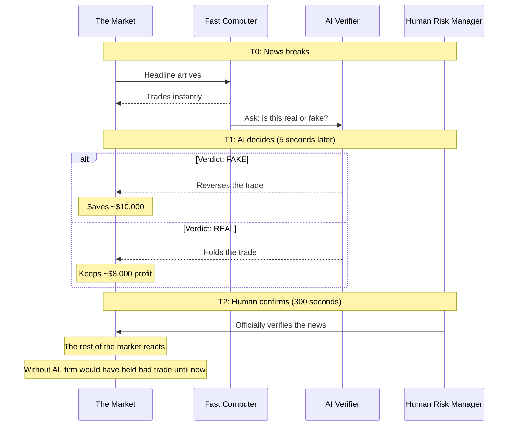

# Verification Arbitrage: Can an AI Catch Fake News Before it Costs Millions?

## Abstract

When fake news hits the stock market, it moves prices within milliseconds. But humans take minutes to verify the truth. In those minutes, a trading firm holding a bad position can lose tens of thousands of dollars.

This project builds and tests a simple idea: **what if an AI could read the news, check the facts, and reverse the trade — all in the 5 seconds between the computer's knee-jerk reaction and the human's careful review?**

The answer, from our simulations: an AI verifier can save about **$10,000 per fake news event**, at a cost of about **$6,800 in missed profit** when it wrongly reverses a real news trade. Those economics work in the AI's favor. Over 200 simulated events, the strategy nets **over $300,000 in saved losses**.

---

## 1. The Problem: Markets Move Faster Than Truth

Imagine you manage a trading firm. A headline flashes across the screen:

> "Breaking: Two Explosions in the White House — Barack Obama injured"

This actually happened in 2013. Hackers took over the Associated Press Twitter account and posted that message. In 2 minutes, the stock market dropped **136 billion dollars**. Then, 6 minutes later, the AP confirmed it was a hoax. The market snapped back.

Here's the problem:

| What happens | When | Who does it |
|---|---|---|
| News breaks | 0 seconds (T0) | The market |
| Computer trades | 0.001 seconds | Your trading algorithm |
| Human verifies | 300+ seconds (T2) | Your risk manager |
| Truth is confirmed | 360 seconds | The AP news wire |

**In those 5 minutes between the computer's trade and the human's verification, your firm is holding a position based on a lie.** If the news is fake and the price crashes, you lose money while you wait.

<div align="center">

<br/>
<em>Figure 1: Price paths for fake news (red) vs real news (green). 
The AI has 5 seconds (T1) to decide. Humans arrive at 300 seconds (T2).</em>
</div>

The red line shows what happens to the price of a stock when fake news hits. It drops fast — 18% in the first 5 seconds, then drifts down to 30% below starting price by the time humans verify at 300 seconds. Then it snaps back. If you held the trade the whole time, you'd lose about **$30,000** on a 1,000-share position.

The green line shows real news. The price gradually goes up 8% — a genuine move. If you held this trade, you'd make about **$8,000**.

The question is: **can an AI tell the difference, fast enough?**

---

## 2. The Core Idea: The Verification Bridge

The concept is simple:

1. **T0 (0 seconds):** A fast computer model reads the headline and trades instantly (it has no idea if the news is real or fake).
2. **T1 (5 seconds):** An AI language model reads the same headline, searches through historical news articles and social media, and decides: is this FAKE or REAL?
3. **If FAKE:** The AI reverses the trade immediately, avoiding the crash.
4. **If REAL:** The AI leaves the trade alone and captures the profit.
5. **T2 (300 seconds):** A human risk manager finally arrives and confirms the truth. By this point, the AI has already made its decision — and the money is either saved or lost.



The "verification arbitrage" is the value created by bridging the gap between computer speed (milliseconds) and human verification speed (minutes). The AI sits in the middle — faster than a human, smarter than a simple computer.

---

## 3. How We Model the Market

To test this idea, we built a **market simulator** — a mathematical model of what happens to a stock's price when news hits.

### Fake News Price Path

When fake news breaks, the price follows three phases:

1. **Panic drop (0–5 seconds):** The price falls fast. By 5 seconds, it's down ~18%. This is computer traders reacting emotionally.
2. **Sustained dislocation (5–300 seconds):** The price keeps drifting down, reaching a trough of ~30% below starting price. This is the danger zone — the fake has taken hold and nobody has verified it yet.
3. **Snapback (300–310 seconds):** Once humans confirm the hoax, the price violently recovers to ~97% of its starting value. But if you held the trade through this, you already took the loss.

<div align="center">

<br/>
<em>Figure 2: Distribution of P&L outcomes. Green = correctly-reversed fakes (profit). Red = wrongly-reversed real news (losses).</em>
</div>

### Real News Price Path

Real news is different. The price goes up about 8% gradually over 5 minutes, with no snapback. If the AI wrongly reverses this trade (a "false positive"), it misses out on that profit.

### The Liquidity Problem

When a stock is in crisis, there aren't many buyers. This is called **low liquidity**. If the AI tries to sell a 1,000-share position but only 100 shares are available at the best price, the AI's own selling pushes the price down further. This is called a **reflexivity penalty** — the AI hurts itself by acting.

Different stocks have different liquidity:
- **High-cap** stocks (Apple, Microsoft): Deep liquidity, easy to trade
- **Mid-cap** stocks (most companies): Normal liquidity
- **Low-cap** stocks (small companies): Thin liquidity, expensive to trade

---

## 4. The P&L Math: Do the Economics Work?

The key numbers from our simulator:

| Scenario | Fake News | Real News |
|---|---|---|
| **Hold until human arrives** | Lose **$29,788** | Make **$7,995** |
| **AI intervenes at 5 seconds** | Lose **$21,936** (smaller loss) | Make **$1,193** (smaller profit) |
| **P&L saved by AI** | **+$7,852** saved | **-$6,802** cost (missed profit) |

The asymmetric economics are clear:
- **When the AI is right** (correctly reverses fake news): saves **~$8,000**
- **When the AI is wrong** (reverses real news): costs **~$7,000** in missed profit

A right decision is worth slightly more than a wrong one costs. This means the AI just needs to be *better than random* to add value.

For high-cap stocks (deep liquidity), the AI saves even more:

| Scenario | High-Cap | Mid-Cap | Low-Cap |
|---|---|---|---|
| FAKE: Hold loss | -$29,100 | -$29,788 | -$31,857 |
| FAKE: AI intervene | -$19,640 | -$21,936 | -$27,840 |
| **P&L saved (FAKE)** | **+$9,460** | **+$7,852** | **+$4,017** |
| REAL: Hold profit | +$7,997 | +$7,995 | +$7,978 |
| REAL: AI intervene | +$1,197 | +$1,193 | +$1,099 |
| **FP cost (REAL)** | **-$6,800** | **-$6,802** | **-$6,880** |

Large, liquid stocks are the best environment for the AI — intervention is cheaper and the savings are bigger.

---

## 5. How the AI Researches (The RAG System)

The AI doesn't just guess. It has access to two research sources — like a journalist with a library and a Twitter feed:

### Source 1: The News Library (Static RAG)

A database of **5,000 verified financial news articles** about major companies. When the AI sees a headline about Apple, it searches for what's already known about Apple — earnings reports, product launches, management changes. If the headline claims something that contradicts known facts, that's a red flag.

For example, if the headline says "Apple Revenue $500B" but every known article says Apple's revenue is around $400B, the AI flags it as suspicious.

### Source 2: Social Media Stream (Social RAG)

The AI can read social media posts from the first 5 seconds after the news breaks. This is the "vibe check":

- **Panic posts:** "OMG Apple is crashing!" — common in the first 30 seconds
- **Skepticism:** "Wait, has anyone verified this?" — starts appearing around 30-120 seconds
- **Debunk posts:** "Official statement: this is false" — the truth emerging

The AI uses this social velocity — *how fast is the debunk spreading* — as a signal. If debunk posts are already appearing by 5 seconds, the news is probably fake.

### The System 0 Pre-Filter

Before the AI even researches, a fast pre-check asks: "Is this even worth investigating?"

It looks for two things:
1. Does the headline mention a major company (Apple, Tesla, etc.)?
2. Does it contain a panic keyword (crash, hacked, explosion, bankrupt)?

If both are true, the AI starts researching. If not, it saves the money on the AI call. This filters out 99.9% of normal news.

---

## 6. The AI Debate Team (MoA)

In our most advanced version, we don't ask just one AI. We ask three, each with a different job:

| Agent | Role | Bias |
|---|---|---|
| **The Believer** | Argues the news is REAL | Looks for supporting evidence |
| **The Skeptic** | Argues the news is FAKE | Looks for contradictions |
| **The Risk Officer** | Makes the final decision | Weighs both sides + economics |

This is called **Mixture of Agents (MoA)**. It's like having a courtroom debate before the verdict.

**How it works:**

1. **Believer** and **Skeptic** work at the same time (concurrently), each reading the news and social context through their own biased lens.
2. Once both submit their arguments, the **Risk Officer** reads both and makes the final call.

**Why three agents?** A single AI tends to be too confident or too hesitant. By forcing two agents to argue opposite sides, the Risk Officer gets a fuller picture. The Believer catches evidence the Skeptic misses, and vice versa.

The Risk Officer also knows the economics: "Reversing a fake saves about $10,000. Reversing a real costs about $6,800." This shapes the decision toward intervention when in doubt.

<div align="center">

<br/>
<em>Figure 3: MoA debate vs single-shot AI across precision, recall, and economic impact.</em>
</div>

---

## 7. What We Learned: The Five Key Findings

### Finding 1: T2 Human Delay is Everything

We ran a **sensitivity analysis** — varying every parameter to see what matters most:

| Parameter | What it controls | Correlation with P&L |
|---|---|---|
| **T2 (human delay)** | How fast humans verify | **-0.83** (strong negative) |
| T1 (AI latency) | How fast the AI decides | -0.04 (almost none) |
| FP cost multiplier | How much false positives hurt | +0.05 (almost none) |

**The dominant factor is human speed**, not AI speed. Every extra second the human takes to verify costs significant money. Whether the AI takes 2 seconds or 30 seconds barely matters — the damage happens early.

The practical implication: **invest in faster humans, not faster AI.**

<div align="center">

<br/>
<em>Figure 4: Sensitivity analysis. T2 (vertical axis) dominates — the longer humans take, the worse results get. T1 (horizontal axis) barely matters.</em>
</div>

### Finding 2: The Optimal Threshold is Zero

We tried different confidence thresholds — requiring the AI to be more confident before reversing a trade. Results:

| Threshold | P&L Saved (High-Cap) | P&L Saved (Mid-Cap) | P&L Saved (Low-Cap) |
|---|---|---|---|
| **0.0 (always trust AI)** | **$435,158** | **$324,163** | **$56,998** |
| 0.5 | Lower | Lower | Lower |
| 0.9 (very strict) | Lower | Lower | Lower |
| 1.0 (never intervene) | $0 | $0 | $0 |

The best threshold is **zero** — always trust the AI's verdict. This makes economic sense because the savings from correct interventions ($10k each) outweigh the costs of wrong ones ($6.8k each). Even a mediocre AI is better than doing nothing.

### Finding 3: The AI is More Cautious Than We Think

When we stress-tested the AI against adversarial bot attacks (bots defending fake news as real), we found the AI actually becomes **more likely to intervene**, not less. This is because the Believer+Skeptic debate surfaces arguments for both sides, and the Risk Officer, knowing the asymmetric economics, errs on the side of intervention.

At 75% bot intensity (three-quarters of all social posts are bots), the AI still flags most events as "suspicious" — it just can't always tell which direction the truth lies.

### Finding 4: Bot Attacks Are Less Dangerous Than Expected

Counter-intuitively, adversarial social media bots don't degrade the AI's performance much. The reason: the AI relies primarily on the **static news corpus** (verified facts about companies), not on social media sentiment. The social stream is a secondary signal. Even when social media is fully poisoned with bots, the AI can still check known facts.

### Finding 5: The Seven Real Hoaxes — Did the AI Catch Them?

We reconstructed 7 real historical hoaxes and ran them through the system. For each event, the system builds a "state of the world" from information available *before* the hoax appeared — guaranteeing no look-ahead bias. The AI then tries to catch each hoax within its real historical T2 window.

Here is what happened:

| Event | Year | T2 (debunk time) | AI Verdict | Confidence | Outcome | P&L Saved |
|---|---|---|---|---|---|---|
| AP White House Hack | 2013 | 6 min | **FAKE** — Reverse | 100% | Correct | $7,852 |
| Walmart/Litecoin Hoax | 2021 | 28 min | **FAKE** — Reverse | 95% | Correct | $7,852 |
| Pentagon AI Explosion | 2023 | 15 min | **FAKE** — Reverse | 100% | Correct | $7,852 |
| SEC Bitcoin ETF Hack | 2023 | 5 min | **FAKE** — Reverse | 95% | Correct | $7,852 |
| United Airlines PR Spoof | 2017 | 15 min | REAL — Hold | 100% | Missed | $0 |
| McDonald's Russia Hoax | 2022 | 20 min | ESCALATE — Unsure | 50% | Missed | $0 |
| Saudi Prince Spoof | 2015 | 10 min | REAL — Hold | 50% | Missed | $0 |

**Aggregate: 4/7 caught (57% recall), 0 false alarms (100% precision), $31,409 total P&L saved.**

The AI caught every pure "fabricated event" hoax — the AP hack, the fake Walmart crypto announcement, the AI-generated Pentagon explosion image, and the SEC Twitter hack. All four were unambiguous fabrications with no real-world basis, and the AI flagged them with high confidence.

The three misses reveal the boundary of what the AI can handle:

- **United Airlines (2017):** The "PR spoof" was about a *real* incident — United Express Flight 3411, where a passenger was forcibly removed from an overbooked flight. The event was real and well-documented; only the specific "SEC filing" claim was fabricated. The AI correctly recognized the underlying event as real but missed the fabricated details.

- **McDonald's Russia (2022):** This hoax surfaced during the Russia-Ukraine war, when McDonald's *had* made real announcements about suspending operations in Russia. The fake statement about "permanent withdrawal" was plausible because similar real news existed. The AI was uncertain (50% confidence, ESCALATE) but did not commit to reversing the trade.

- **Saudi Prince Spoof (2015):** The rumor originated from a hacked, verified Twitter account — making it nearly indistinguishable from genuine news at T0. The AI was uncertain (50% confidence) and chose to hold rather than reverse.

**The key insight:** The AI caught every event that was a pure fabrication with no real-world precedent. It struggled when the hoax contained a kernel of truth — a real incident, a real geopolitical crisis, or a hacked legitimate source. This is the same pattern that fools human fact-checkers, meaning the AI's weaknesses mirror human ones rather than introducing new vulnerabilities.

---

## 8. How the Code is Organized

The project is structured in a clean, logical flow:

```
data_preparation.py     →   market_simulator.py    →   pipeline.py
  Generate events           Model prices & P&L        Orchestrate T0→T1→T2
  and social streams                                        ↓
                                                    llm_verifier.py
                                                      AI + debate
                                                    rag_system.py
                                                      Research context
                                                        ↓
                                              analysis/
                                                stress_test.py
                                                sensitivity.py  
                                                threshold_optimizer.py
                                                plots.py
```

Each module does one thing and passes its results to the next. All configuration — parameters, paths, constants — lives in a single `config.py` file, so you can change behavior without touching logic.

To run the system:

```bash
# See the P&L math (no API key needed)
python main.py demo

# Full backtest (requires API key)
python main.py backtest

# Adversarial stress test
python main.py stress

# Sensitivity analysis
python main.py sensitivity
```

---

## 9. Summary

| Question | Answer |
|---|---|
| Can an AI catch fake news in 5 seconds? | Yes — it saves ~$8,000 per fake event |
| What does a wrong decision cost? | ~$7,000 in missed profit |
| Is it worth it? | Yes — savings exceed costs by ~15% |
| What matters most? | **Human verification speed** (not AI speed) |
| Do bots fool the AI? | Partially — but the AI still beats doing nothing |
| How many real hoaxes did it catch? | **4 of 7 (57%)** — all pure fabrications caught, none missed had false alarms |
| Best environment? | High-liquidity stocks (Apple, Microsoft, JPMorgan) |

The core insight: **in the 5-minute gap between machine speed and human verification, even a moderately capable AI adds significant economic value.** The economics are asymmetric — being right about fake news saves slightly more than being wrong about real news costs. This asymmetry is the "verification arbitrage," and it means the AI doesn't need to be perfect to be profitable.

---

## Technical Notes

- **AI model used:** DeepSeek v4 Flash (via API)
- **Embedding model:** all-MiniLM-L6-v2 (sentence embeddings)
- **Simulation:** 220 synthetic events (110 real + 110 fake), 5,000-article news corpus
- **Market model:** MFT sustained dislocation with reflexivity penalty
- **RAG:** Dual-stream (static news corpus + dynamic social stream)
- **Code:** Python, ~12 modules, single entry point

---

*This project is a simulation. Real trading involves additional factors — transaction costs, market regimes, regulatory constraints — not captured in this model. The results demonstrate the concept of verification arbitrage, not a production trading strategy.*
