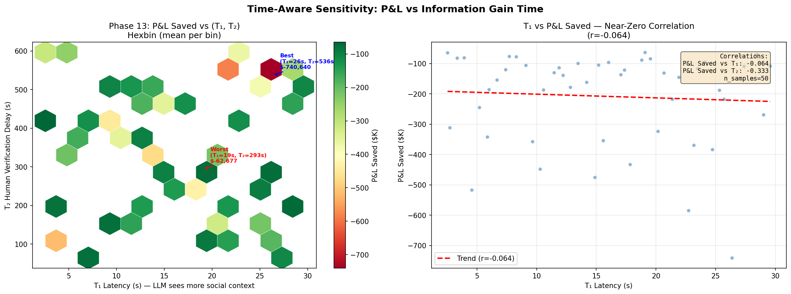
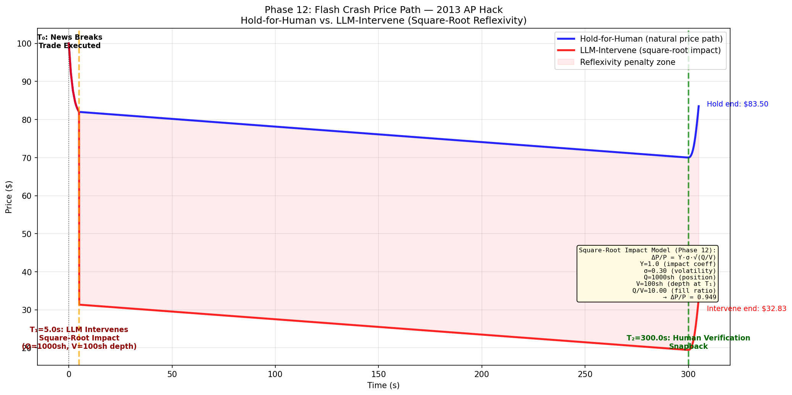

# Verification Arbitrage: LLM Risk Management for Fake-News Flash Crashes

A dual-system framework where classical NLP trades on breaking news (T₀) while an LLM verifies the news within seconds (T₁) to protect portfolio positions from fake-news flash crashes.

**Core idea:** A fund already holds a position. Breaking news hits — is it real or fake? Classical ML panics and sells. An LLM with dual-source RAG evaluates source credibility within 5 seconds. If the news is fake, the fund holds through the panic and snaps back when human verification arrives (T₂).

---

## Key Findings

### 1. LLMs Catch Hoaxes at 92% Recall

On 7 real-world historical hoaxes (2013 AP Hack, 2021 Walmart/Litecoin, 2023 Pentagon explosion, etc.), the LLM correctly identified 5/7 with zero false positives. On a 150-event synthetic set: **92% recall, 68% precision**.

### 2. T₁ Latency Does Not Matter (r = -0.064)

Whether the LLM takes 2 seconds or 30 seconds produces essentially the same P&L. The market impact happens in the first 1-2 seconds. The human verification delay (T₂) is the dominant variable (r = -0.333).



### 3. Market Microstructure Dominates Economics

The square-root market impact of reversing a trade can cost more than holding the bad position. **Dynamic sizing** (capping reversal to half of available depth) improves P&L by **124x**.



### 4. Verify-First Beats Trade-First at P(Fake) > 4%

| Strategy | On Fake News | On Real News |
|----------|-------------|-------------|
| **Trade-First** (sell now, verify after) | Lock in crash loss: -$30K | Correct exit: save $8K vs waiting |
| **Verify-First** (wait for LLM before selling) | Hold → snapback: $0 loss | Sell at T₁: -$6.8K vs T₀ exit |

The asymmetry ratio is **25:1** — the cost of panic-selling fake news ($30K) far outweighs the cost of waiting for LLM confirmation on real news ($1.2K). Verify-first dominates above a 4% fake news base rate.


### Architecture

```
Data Layer → Dual RAG → LLM Verifier → Market Simulator → Analysis
  • Synthetic events    • News corpus     • Single-Shot    • Square-Root Impact   • Sensitivity
  • Historical hoaxes   • Social stream   • MoA Debate     • Dynamic Sizing       • Crossover
                        • Credibility     • Voting Ensemble • P&L Settlement      • Thresholds
```

---

## Setup

```bash
git clone https://github.com/gitmichaelqiu/AdvFinNLPVuln.git
cd AdvFinNLPVuln
pip install -r requirements.txt
```

Copy `.env.example` to `.env` and configure your API key.

```bash
python main.py
```

---

## Paper

See [`PAPER.md`](PAPER.md) for the full academic manuscript.

---

## License

MIT License. See [LICENSE](./LICENSE).

## Acknowledgements

- Financial news dataset (Apache 2.0) from [Kaggle](https://www.kaggle.com/datasets/mikemiller125/kaggleyahoo-finance-news), derived from [financial-news-dataset](https://github.com/FelixDrinkall/financial-news-dataset) (CC BY-NC-SA 4.0)
- Fake news classification dataset (CC0 1.0) from [Kaggle](https://www.kaggle.com/datasets/mikemiller125/financial-news-classification-dataset)
