# General AI Information Verification Framework — Roadmap

A domain-agnostic framework for verifying AI-generated or human-authored information claims using configurable verifier architectures (single-shot, voting, MoA debate, RAG-augmented) with hybrid risk-based decision policies.

Finance is the first case-study domain (Phase 2). Cross-domain readiness is validated in Phase 9.

```mermaid
graph LR
    P0[Phase 0: Reproducibility] --> P1[Phase 1: Unified Schema & Metrics]
    P1 --> P2[Phase 2: Finance Dataset Adapter]
    P2 --> P3[Phase 3: Single-Shot Verifier]
    P3 --> P4[Phase 4: Voting Verifier]
    P4 --> P5[Phase 5: MoA/Debate Verifier]
    P5 --> P6[Phase 6: RAG Verifier]
    P6 --> P7[Phase 7: Hybrid Policy]
    P7 --> P8[Phase 8: Sensitivity Analysis]
    P8 --> P9[Phase 9: Cross-Domain Readiness]
```



---

## Phase 0: Repository Sanity Check & Reproducibility Setup

**Objective:** Verify that the repository is in a known-good state — dependencies install cleanly, legacy modules are quarantined, docs scaffold exists, and a single command can run the first end-to-end smoke test.

### Files to create/edit
- `requirements.txt` — audit existing, pin exact versions, add `pytest`, `pytest-cov`
- `Makefile` — common targets: `install`, `test`, `lint`, `clean`
- `pyproject.toml` — project metadata, tool configs (pytest, ruff/black)
- `tests/conftest.py` — shared fixtures
- `tests/test_schemas.py` — verify schema validation
- `docs/research_log.md` — project research log
- `docs/architecture_notes.md` — architectural decisions
- `.env.example` — template for secrets (API keys)

### Implementation tasks
1. Freeze `requirements.txt` with pinned versions
2. Create `Makefile` with `install`, `test`, `clean` targets
3. Create `pyproject.toml` with project metadata
4. Verify `pip install -e .` works
5. Add `.env.example` with `OPENAI_API_KEY` and `DEEPSEEK_API_KEY`
6. Create `tests/conftest.py` with `pytest` fixtures

### Experiments to run
- `pip install -r requirements.txt && python -c "import src; print('OK')"`
- `python -m pytest tests/ -v`

### Metrics to report
- Test pass/fail count
- Dependency installation time

### Expected output artifacts
- `requirements.txt` (pinned)
- `Makefile`
- `pyproject.toml`
- `tests/conftest.py`
- `docs/research_log.md`
- `docs/architecture_notes.md`

### Copy back to ChatGPT
```
Phase 0 complete. Repository is reproducible. Dependencies pinned. Test suite passes.
Makefile targets: install, test, lint, clean.
```

---

## Phase 1: Unified Verification Schema & Metrics

**Objective:** Define the canonical data structures (schemas, verdicts, evidence) and metrics computation (precision, recall, F1, FPR, FNR, PPV, NPV, calibration error) that all verifier architectures will share.

### Files to create/edit
- `src/__init__.py` — package exports
- `src/schemas.py` — `VerificationItem`, `Verdict`, `VerificationResult`, `VerifierConfig`
- `src/metrics.py` — `compute_confusion_matrix()`, `classification_metrics()`, `calibration_metrics()`
- `src/logging_utils.py` — structured result logging, ledger helpers
- `tests/test_schemas.py` — schema validation tests
- `tests/test_metrics.py` — metrics correctness tests
- `docs/dataset_notes.md` — document dataset schema

### Implementation tasks
1. Define `VerificationItem` dataclass (id, claim_text, context, metadata, ground_truth)
2. Define `Verdict` enum (REAL, FAKE, ESCALATE, EXAGGERATED) with confidence
3. Define `VerificationResult` dataclass (item_id, verdict, confidence, latency, evidence)
4. Define `VerifierConfig` dataclass (model, temperature, max_tokens, prompt_template)
5. Implement `compute_confusion_matrix()` with integer counts (TP, FP, TN, FN)
6. Implement `classification_metrics()` returning precision, recall, F1, FPR, FNR
7. Implement `calibration_metrics()` with ECE computation
8. Implement `compute_ppv()` with Bayesian base-rate sweep
9. Create `logging_utils.py` with `ExperimentLogger` that saves structured JSON results
10. Write unit tests for all schema validation and metric computations

### Experiments to run
- `python -c "from src.schemas import Verdict; print(Verdict.FAKE.value)"`
- `python -m pytest tests/test_schemas.py tests/test_metrics.py -v`

### Metrics to report
- Unit test coverage for schemas and metrics modules

### Expected output artifacts
- `src/schemas.py`
- `src/metrics.py`
- `src/logging_utils.py`
- `tests/test_schemas.py`
- `tests/test_metrics.py`
- `docs/dataset_notes.md`

### Copy back to ChatGPT
```
Phase 1 complete. Unified schemas defined (VerificationItem, Verdict, VerificationResult, VerifierConfig).
Metrics module implements confusion matrix, precision/recall/F1/FPR/FNR, ECE calibration, and Bayesian PPV.
All verified by unit tests.
```

---

## Phase 2: Finance Case-Study Dataset Adapter

**Objective:** Adapt the legacy finance news dataset into the unified schema. Build a dataset adapter that produces `VerificationItem` objects from both synthetic and real financial news sources. This adapter serves as the template for future domain adapters.

### Files to create/edit
- `src/datasets.py` — base `DatasetAdapter` ABC, `load_dataset()`, train/test split
- `src/finance/__init__.py` — finance subpackage
- `src/finance/finance_dataset_adapter.py` — `FinanceDatasetAdapter( DatasetAdapter)`
- `src/finance/finance_metrics.py` — finance-specific metric wrappers (crossover thresholds, P&L estimation)
- `src/finance/finance_case_study.py` — case-study orchestration script
- `tests/test_finance_adapter.py` — adapter tests
- `docs/finance_results_log.md` — structured experiment log (template)

### Implementation tasks
1. Implement `DatasetAdapter` ABC with `load()`, `train_test_split()`, `item_counts()` methods
2. Implement `FinanceDatasetAdapter` that loads synthetic + real financial news
3. Map legacy labels (FAKE/REAL) to `Verdict` enum
4. Implement `load_dataset()` factory function
5. Create `finance_case_study.py` CLI that loads adapter, runs through a verifier, logs results
6. Structure `finance_results_log.md` with experiment template (see docs section)

### Experiments to run
- `python -c "from src.finance.finance_dataset_adapter import FinanceDatasetAdapter; d = FinanceDatasetAdapter(); print(d.item_counts())"`
- `python -m pytest tests/test_finance_adapter.py -v`

### Metrics to report
- Dataset size, class balance, train/test split sizes

### Expected output artifacts
- `src/datasets.py`
- `src/finance/finance_dataset_adapter.py`
- `src/finance/finance_metrics.py`
- `src/finance/finance_case_study.py`
- `tests/test_finance_adapter.py`
- `docs/finance_results_log.md`

### Copy back to ChatGPT
```
Phase 2 complete. FinanceDatasetAdapter maps legacy financial news data into unified VerificationItem schema.
Adapter produces N train / M test items with documented class balance.
Template established for future domain adapters.
```

---

## Phase 3: Single-Shot LLM Verifier

**Objective:** Implement the simplest verifier — a single LLM call with a system prompt. Establish the baseline LLM verification performance against the finance dataset. This is the "fast path" verifier.

### Files to create/edit
- `src/llm_clients.py` — `LLMClient` ABC, `OpenAIClient`, `DeepSeekClient`
- `src/verifier_single_shot.py` — `SingleShotVerifier` with CoT parsing
- `src/prompts.py` — update with domain-agnostic prompt templates
- `src/base_rate.py` — Bayesian PPV/NPV, base-rate analysis utilities
- `tests/test_llm_clients.py` — client tests (mock mode)
- `tests/test_verifier_single_shot.py` — end-to-end verifier tests

### Implementation tasks
1. Implement `LLMClient` ABC with `generate()` and `generate_batch()` methods
2. Implement `OpenAIClient` and `DeepSeekClient` wrappers
3. Implement mock mode: fallback to heuristic classifier when no API key
4. Implement `SingleShotVerifier` with configurable system prompt
5. Implement CoT parser that extracts verdict + confidence + evidence from LLM output
6. Update `src/prompts.py` with domain-agnostic verification prompts
7. Implement `base_rate.py` with Bayesian update and PPV computation
8. Run end-to-end verification on finance dataset

### Experiments to run
- `python -m src.verifier_single_shot --model gpt-4o-mini --test-size 50`
- `python -m src.verifier_single_shot --model deepseek-chat --test-size 50`
- `python -m pytest tests/test_verifier_single_shot.py tests/test_llm_clients.py -v`

### Metrics to report
- Precision, Recall, F1, FPR, FNR (per model)
- Mean latency (per model)
- Confusion matrix (raw integer counts)
- PPV at tested base rates
- Calibration ECE

### Expected output artifacts
- `src/llm_clients.py`
- `src/verifier_single_shot.py`
- `src/prompts.py` (updated)
- `src/base_rate.py`
- `tests/test_llm_clients.py`
- `tests/test_verifier_single_shot.py`
- `results/phase03_single_shot_metrics.json`
- Log entry in `docs/finance_results_log.md`

### Copy back to ChatGPT
```
Phase 3 complete. Single-shot verifier implemented with OpenAIClient and DeepSeekClient.
Baseline metrics: Prec=XX, Rec=XX, F1=XX, FPR=XX, FNR=XX at N=XX.
ECE=XX, PPV at 5% base rate = XX%.
```

---

## Phase 4: Voting Verifier

**Objective:** Implement a voting ensemble verifier that calls the LLM N times (default 5) with varied prompts or temperatures and aggregates verdicts by majority vote. Compare precision/recall trade-off against single-shot baseline.

### Files to create/edit
- `src/verifier_voting.py` — `VotingVerifier` with configurable N, aggregation strategy
- `tests/test_verifier_voting.py` — voting verifier tests

### Implementation tasks
1. Implement `VotingVerifier` that spawns N parallel LLM calls
2. Support multiple aggregation strategies: majority, weighted (by confidence), unanimous
3. Support prompt variation (different framing per voter) or temperature variation
4. Implement tie-breaking rules
5. Run comparison against single-shot baseline on finance dataset
6. Analyze latency vs. accuracy trade-off

### Experiments to run
- `python -m src.verifier_voting --n-voters 3 --test-size 50`
- `python -m src.verifier_voting --n-voters 5 --test-size 50`
- `python -m src.verifier_voting --n-voters 7 --test-size 50`
- Compare results with Phase 3 single-shot

### Metrics to report
- Precision, Recall, F1, FPR, FNR (per N)
- Mean latency per N
- Confusion matrix per N
- Latency-precision Pareto frontier
- Variance across voters (agreement rate)

### Expected output artifacts
- `src/verifier_voting.py`
- `tests/test_verifier_voting.py`
- `results/phase04_voting_metrics.json`
- Log entry in `docs/finance_results_log.md`

### Copy back to ChatGPT
```
Phase 4 complete. Voting verifier implemented with N=3,5,7.
Best F1=XX at N=X with latency=XXs.
Pareto frontier shows diminishing returns after N=X.
```

---

## Phase 5: MoA/Debate Verifier & Degeneracy Tests

**Objective:** Implement a Mixture-of-Agents (MoA) debate verifier with Believer/Skeptic/Risk Officer roles. Conduct systematic degeneracy tests — always-FAKE bias, always-REAL bias, base-rate tracking, precision-above-base-rate checks — to validate that the debate architecture produces genuine reasoning rather than superficial patterns.

### Files to create/edit
- `src/verifier_moa.py` — `MoAVerifier` with role-based agents
- `tests/test_verifier_moa.py` — degeneracy tests, base-rate checks

### Implementation tasks
1. Implement `MoAVerifier` with configurable roles
2. Implement Believer (pro-authenticity), Skeptic (pro-hoax), Risk Officer (synthesis) prompts
3. Implement concurrent execution (Believer + Skeptic in parallel, Risk Officer after)
4. Implement degeneracy test suite:
   - Always-FAKE check: precision vs base rate at 0% bot intensity
   - Always-REAL check: recall on known-fake items
   - Base-rate tracking: does precision significantly exceed P(FAKE)?
5. Run comparison against single-shot and voting baselines

### Experiments to run
- `python -m src.verifier_moa --test-size 50`
- Degeneracy tests: `python -m pytest tests/test_verifier_moa.py -v`

### Metrics to report
- Precision, Recall, F1, FPR, FNR
- Latency breakdown (Believer, Skeptic, synthesis)
- Degeneracy test results (pass/fail per test)
- Precision vs. base rate comparison

### Expected output artifacts
- `src/verifier_moa.py`
- `tests/test_verifier_moa.py`
- `results/phase05_moa_metrics.json`
- Log entry in `docs/finance_results_log.md`

### Copy back to ChatGPT
```
Phase 5 complete. MoA verifier with Believer/Skeptic/Risk Officer roles.
Degeneracy tests: always-FAKE=[PASS/FAIL], always-REAL=[PASS/FAIL],
precision > P(FAKE)=[PASS/FAIL]. MoA F1=XX vs single-shot F1=XX.
```

---

## Phase 6: RAG-Based Verifier

**Objective:** Implement a retrieval-augmented verifier that supplements the LLM call with relevant context from a knowledge corpus. This grounds verification in external evidence rather than relying solely on parametric knowledge.

### Files to create/edit
- `src/verifier_rag.py` — `RAGVerifier` with corpus retrieval + LLM synthesis
- `tests/test_verifier_rag.py` — RAG verifier tests

### Implementation tasks
1. Implement `RAGVerifier` that retrieves relevant context before LLM call
2. Build light-weight corpus index (sentence embeddings + FAISS or simple TF-IDF)
3. Implement context window management (truncation, relevance scoring)
4. Support configurable retriever: dense (embedding) or sparse (TF-IDF)
5. Run comparison: RAG vs. non-RAG single-shot
6. Analyze context quality metrics (retrieval precision, context utilization)

### Experiments to run
- `python -m src.verifier_rag --retriever dense --test-size 50`
- `python -m src.verifier_rag --retriever sparse --test-size 50`
- Compare with Phase 3 (no-RAG baseline)

### Metrics to report
- Precision, Recall, F1, FPR, FNR (dense vs sparse)
- Retrieval latency
- Context relevance score
- Improvement over no-RAG baseline

### Expected output artifacts
- `src/verifier_rag.py`
- `tests/test_verifier_rag.py`
- `results/phase06_rag_metrics.json`
- Log entry in `docs/finance_results_log.md`

### Copy back to ChatGPT
```
Phase 6 complete. RAG verifier with dense and sparse retrievers.
F1 improvement over no-RAG baseline: +XX (dense), +XX (sparse).
Retrieval latency: XXs (dense), XXs (sparse).
```

---

## Phase 7: Hybrid Policy Based on Misinformation Base Rate & Risk

**Objective:** Implement a hybrid policy that selects or weights verifier outputs based on context — the estimated base rate of misinformation, the cost asymmetry of false positives vs. false negatives, and the verifier's confidence calibration. This replaces the old "three-tier abstention" with a mathematically principled decision rule.

### Files to create/edit
- `src/hybrid_policy.py` — `HybridPolicy` decision rule
- `src/base_rate.py` — extend with cost-sensitive decision thresholds
- `tests/test_hybrid_policy.py` — policy tests

### Implementation tasks
1. Formalize the decision problem: choose action (HOLD / HEDGE / REVERSE / ESCALATE) to minimize expected cost
2. Implement `HybridPolicy` that takes verifier output + base rate estimate + cost matrix → action
3. Implement cost-sensitive threshold computation (asymmetric loss)
4. Implement base rate estimation from stream statistics or prior
5. Implement meta-policy: which verifier to deploy based on estimated base rate
6. Run end-to-end: dataset → verifier → policy → action

### Experiments to run
- `python -m src.hybrid_policy --test-size 50 --cost-fp 1.0 --cost-fn 10.0`
- Sweep cost asymmetry ratios (1:1, 1:5, 1:10, 1:25, 1:100)

### Metrics to report
- Expected cost per decision (under various cost ratios)
- Action distribution (% HOLD vs % HEDGE vs % REVERSE vs % ESCALATE)
- Cost savings vs. "always reverse" and "always hold" baselines
- Decision threshold values at each cost ratio

### Expected output artifacts
- `src/hybrid_policy.py`
- `src/base_rate.py` (extended)
- `tests/test_hybrid_policy.py`
- `results/phase07_hybrid_policy_metrics.json`
- Log entry in `docs/finance_results_log.md`

### Copy back to ChatGPT
```
Phase 7 complete. Hybrid policy minimizes expected cost under asymmetric loss.
At FP:FN=1:10, decision threshold = XX%, expected cost = $XX vs
always-reverse cost = $XX. Action distribution: HOLD=XX%, HEDGE=XX%,
REVERSE=XX%, ESCALATE=XX%.
```

---

## Phase 8: Sensitivity Analysis

**Objective:** Systematically vary all key parameters and measure the impact on verification performance. Identify which parameters drive results and establish safe operating ranges. This replaces the old domain-specific microstructure sensitivity with a framework-agnostic analysis.

### Files to create/edit
- `src/sensitivity_analysis.py` — parameter sweeps, sensitivity metrics
- `tests/test_sensitivity.py` — sensitivity test harness

### Implementation tasks
1. Define parameter grid: model (gpt-4o-mini, gpt-4o, deepseek-chat, claude-sonnet), temperature (0.0, 0.3, 0.7), prompt template (terse, detailed, CoT), verifier architecture (single, voting, MoA, RAG), dataset balance (50/50, 75/25, 90/10)
2. Implement sweep harness that runs each config and collects metrics
3. Implement sensitivity ranking (which parameters have largest effect on F1?)
4. Implement interaction detection (do certain parameters interact?)
5. Generate summary table of best/worst configurations

### Experiments to run
- Full grid search (may be large — support `--quick` mode with subset)
- `python -m src.sensitivity_analysis --quick --test-size 30`

### Metrics to report
- Sensitivity ranking (F1 variance explained per parameter)
- Best configuration: (model, temperature, prompt, verifier)
- Worst configuration
- Interaction effects between parameters

### Expected output artifacts
- `src/sensitivity_analysis.py`
- `tests/test_sensitivity.py`
- `results/phase08_sensitivity_metrics.json`
- Log entry in `docs/finance_results_log.md`

### Copy back to ChatGPT
```
Phase 8 complete. Sensitivity analysis across 4 parameters.
Top driver: verifier architecture (XX% variance explained).
Best config: {model}+{verifier}+{prompt} with F1=XX.
Safe operating range: temperature [0.0, 0.3], base rate [2%, 50%].
```

---

## Phase 9: Cross-Domain Readiness Check

**Objective:** Validate that the framework generalizes beyond finance by testing on at least two additional domains (e.g., healthcare claims, political statements, or product reviews). Document what domain-specific adaptations were needed and propose a domain-adapter API standard.

### Files to create/edit
- `src/domain_adapter.py` — `DomainAdapter` ABC and registry
- Finance adapter moves to `src/finance/finance_dataset_adapter.py` (update if needed)
- New: `src/healthcare/` or adapt existing health dataset
- New: `src/political/` or adapt third-party political fact-check dataset
- `tests/test_cross_domain.py` — cross-domain evaluation tests

### Implementation tasks
1. Formalize `DomainAdapter` ABC: what methods must every domain implement?
2. If healthcare dataset exists, adapt it; otherwise source a public dataset
3. Source or create a political/statements dataset
4. Run single-shot verifier on both new domains
5. Document domain-specific prompt adjustments needed
6. Propose domain-adapter API standard in `docs/architecture_notes.md`

### Experiments to run
- `python -m src.verifier_single_shot --domain healthcare --test-size 50`
- `python -m src.verifier_single_shot --domain political --test-size 50`
- Compare cross-domain F1 variance

### Metrics to report
- F1 per domain
- F1 variance across domains
- Domain-specific prompt sensitivity
- Dataset quality metrics (label consistency, ambiguity rate)

### Expected output artifacts
- `src/domain_adapter.py`
- Healthcare adapter
- Political adapter
- `tests/test_cross_domain.py`
- `results/phase09_cross_domain_metrics.json`
- Log entry in `docs/finance_results_log.md`

### Copy back to ChatGPT
```
Phase 9 complete. Framework validated across 3 domains: finance (F1=XX),
healthcare (F1=XX), political (F1=XX). Cross-domain F1 variance = XX%.
Domain adapter API standardized. Framework is domain-general.
```

---

# Post-Phase-9 Research Roadmap

**Context:** After completing the general verification framework (Phases 0–9), we conducted a real-API pilot evaluation (240 DeepSeek calls, ~$0.036) comparing Single-Shot, Voting N=3, MoA, and RAG on finance, healthcare, and political domains (N=10 each). The results revealed a critical framing gap: all four architectures are individually well-studied in prior work (FEVER, Self-Consistency, Mixture-of-Agents, Self-RAG). A paper that simply compares architectures would not be novel.

**Pivot:** The likely core contribution should be **latency-aware verifier routing with base-rate- and cost-aware action thresholds** — selecting which architecture to deploy based on the available latency budget, then selecting the intervention action (hold, hedge, reverse, escape) based on the estimated misinformation base rate and cost asymmetry. The phases below reflect this pivot.

**Phase 11 update:** The base-rate-stratified analysis (240 real API outputs, 72 regimes) found **no evidence of base-rate-sensitive architecture switching.** The optimal architecture is stable across base rates (0.1%–50%) and cost ratios (FP:FN 1:1–1:25) within each latency tier. Architecture is selected by **latency budget**, not base rate or cost ratio. Base rate and cost ratio determine the **action policy** (intervention threshold and position sizing), not which verifier to call.

```mermaid
graph LR
    P9[Phase 9: Cross-Domain] --> P10[Phase 10: Lit. Map & Bib.]
    P10 --> P11[Phase 11: Base-Rate-Stratified Analysis ✅]
    P11 --> P12[Phase 12: Escalation-Cost & Action Thresholds]
    P12 --> P13[Phase 13: Statistical Scaling: SS + Voting]
    P13 -.-> P14[Phase 14: MoA Calibration (Optional)]
    P13 -.-> P15[Phase 15: RAG Redesign (Optional)]
    P13 --> P16[Phase 16: Final Consolidation]
    P14 --> P16
    P15 --> P16
```

---

## Phase 10: Literature-Grounded Evidence Map & Bibliography

**Objective:** Build a structured, annotated bibliography organized by the six research dimensions this work touches. This provides the literature backing for the routing-pivot thesis and prevents the paper from claiming novelty in well-studied areas.

**Status:** Draft completed in `docs/meeting_evidence_map.md` (see Literature Context section and Bibliography). This phase formalizes it.

### Organization dimensions
1. **Benchmarks & datasets** — FEVER, SciFact, AVeriTeC, custom financial/political sets
2. **Architecture baselines** — single-shot (zero/few-shot CoT), self-consistency/voting (Wang et al., 2022), debate/MoA (Irving et al., 2018; Wang et al., 2024; Du et al., 2023), RAG (Lewis et al., 2020; Self-RAG: Asai et al., 2023)
3. **Calibration & abstention** — confidence calibration (Hendrycks & Gimpel, 2016), selective classification (Varshney et al., 2022)
4. **Cost-aware LLM routing** — FrugalGPT (Chen et al., 2023), model cascade routing
5. **Class imbalance & PPV** — Provost & Fawcett (1997), Chawla et al. (2002), Bayesian PPV in low-prevalence settings
6. **Finance-specific verification** — flash-crash hoax literature, market microstructure impact of misinformation

### Files to create/edit
- `docs/literature_map.md` — structured bibliography with annotations
- `docs/meeting_evidence_map.md` — already has the Literature Context section; expand with per-reference annotations

### Implementation tasks
1. Classify each citation into the six dimensions above
2. Annotate: what each reference establishes + what gap remains for this work
3. Map existing empirical findings to gaps in the literature

### Expected output artifacts
- `docs/literature_map.md` (structured, annotated bibliography)
- `docs/meeting_evidence_map.md` (updated with full annotations)

### Copy back to Professor
```
Phase 10 complete. Literature organized into 6 dimensions.
Gap confirmed: prior work studies architectures in isolation,
not cost/base-rate/latency-aware routing between them.
```

---

## Phase 11: Base-Rate-Stratified Analysis Using Existing Real API Outputs ✅

**Objective:** Determine the optimal verifier architecture at each base-rate regime using already-collected real API outputs. No new API calls.

**Status: COMPLETE.** Analysis run via `src/phase11_base_rate_routing.py`. Outputs at `results/phase11/` and `docs/phase11_base_rate_routing_summary.md`.

### Key Results

1. **No base-rate-sensitive architecture switching.** The optimal architecture is stable across base rates (0.1%–50%) and cost ratios (FP:FN 1:1–1:25) within each latency tier.

2. **Routing is latency-first:**
   - **<5s budget → Single-Shot** (F1=0.645, P=0.780, R=0.733, Lat=3.9s). The only architecture consistently feasible under 5s.
   - **≥5s budget → Voting N=3** (F1=0.827, P=0.944, R=0.800, FPR=0.067, Lat=13.3s). Dominates on all accuracy metrics.
   - MoA and RAG are never optimal within their feasibility windows.

3. **Architecture win counts (72 regimes total):**
   | Architecture | Regimes Won | Note |
   |---|---|----|
   | Voting N=3 | 30 (42%) | Dominates all ≥5s regimes |
   | Single-Shot | 10 (14%) | Only optimal when Voting is disqualified by latency |
   | RAG | 32 (44%)* | *ESCALATE abstention artifact (see below) |
   | MoA | 0 (0%) | Pareto-dominated by Voting |

4. **RAG's 44% win rate is an artifact.** FPR=0.000 is achieved by treating ESCALATE as a cost-free correct rejection (53% of items). Real recall = 0.267. If ESCALATE carries any operational cost, RAG wins zero regimes.

5. **MoA is Pareto-dominated by Voting N=3.** Never uniquely optimal on any regime (F1=0.747 vs 0.827, latency 19.2s vs 13.3s).

6. **Base rate and cost ratio determine action thresholding** (how to act on the verdict), not architecture selection (which verifier to call).

### Implications for Roadmap
- Phase 12 no longer implements a multi-architecture routing policy (base-rate-driven switching is unsupported).
- Phase 12 instead focuses on escalation cost modeling and action thresholds (what to do with a verdict, not which verifier to call).
- Phase 13 scales only Single-Shot and Voting N=3 (MoA and RAG dropped from default scaling).
- Phases 14–15 are optional: MoA calibration study and RAG redesign, both only if professor deems them important.

---

## Phase 12: Escalation-Cost and Action-Threshold Analysis

**Objective:** Recompute the optimal routing and action policy with explicit ESCALATE costs. No new API calls.

**Motivation:** Phase 11 treated ESCALATE as cost-free (correct rejections = TN, misses = FN). In practice, ESCALATE has real operational costs: manual review, delayed decisions, missed trading opportunities, and potential human-error costs. This phase asks: when ESCALATE is not free, does the optimal policy change?

### Analysis plan
1. **Model ESCALATE cost**: Define cost_escalate as a tunable parameter (multiple of cost_fp or cost_fn). Sweep across ratios where cost_escalate ∈ {0, 0.1, 0.5, 1.0, 2.0} × max(cost_fp, cost_fn).

2. **Recompute regime optimality**: For each (base_rate, cost_fp, cost_fn, cost_escalate, latency_budget), determine:
   - Should we accept the verdict, reverse, hedge, abstain, or escalate?
   - Does RAG ever become useful when escalation is priced?
   - Does MoA's lower ESCALATE rate (10% vs Voting's 23%) justify its latency?

3. **Action mapping**: Define the decision space as:
   - **Accept**: Use verdict as-is (reverse on FAKE, hold on REAL)
   - **Hedge**: Partial position reduction (for ESCALATE or low-confidence predictions)
   - **Reverse**: Full position reversal (for high-confidence FAKE)
   - **Abstain**: No action (for very low confidence)
   - **Escalate**: Route to human review or secondary system (for ESCALATE verdicts)

4. **Output**: Optimal action table × (base_rate, cost_fp, cost_fn, cost_escalate, latency_budget).

### Implementation
- Pure computation on existing per-item predictions from `output/repair_rerun/report.json`
- No API calls needed
- Script: `src/phase12_escalation_analysis.py`

### Expected output artifacts
- `results/phase12/escalation_action_table.csv`
- `results/phase12/escalation_analysis_summary.json`
- `docs/phase12_escalation_analysis_summary.md`

### Copy back to Professor
```
Phase 12 complete. With explicit ESCALATE cost, RAG wins zero regimes.
Optimal action policy is: ESCALATE → hedge/partial reduce (not full reverse).
Voting N=3 remains dominant. Action thresholds shift with cost_ratio as
predicted by cost-sensitive framework.
```

---

## Phase 13: Statistical Scaling of Strongest Candidates

**Objective:** Scale the two relevant architectures (Single-Shot and Voting N=3) to N=50/domain for statistical confidence. MoA and RAG are excluded from default scaling based on Phase 11 results (MoA: never optimal; RAG: ESCALATE artifact).

**Which domains?** Finance + healthcare first. Political only if the professor wants it included — the current 2016-era political dataset shows instability (F1 ranges 0.333–0.571 across runs) and stylistically differs from modern disinformation.

### Design
| Architecture | Domains | Items | API Calls | Est. Cost |
|---|---|---|---|---|
| Single-Shot | Finance, Healthcare (+ Political optional) | 50 each | 100–150 | ~$0.015–0.023 |
| Voting N=3 | Finance, Healthcare (+ Political optional) | 50 each | 300–450 | ~$0.045–0.068 |

### Metrics to report
- 95% bootstrap confidence intervals on: F1, precision, recall, FPR, ECE, latency
- Statistical significance test: does Voting N=3 beat Single-Shot at N=50?
- Cross-run stability: variance across 3 independent runs at N=50
- Updated PPV curves with confidence bands

### Expected output artifacts
- Raw outputs in `output/phase13_scaling/`
- `results/phase13/scaling_metrics.json`

### Copy back to Professor
```
Phase 13 complete. Single-Shot and Voting N=3 scaled to N=50/domain.
Voting N=3 F1 = XX ± XX [95% CI], Single-Shot F1 = XX ± XX [95% CI].
Voting beats Single-Shot with p < 0.05 on [domains]. PPV curves stable
across runs.
```

---

## Phase 14: MoA Calibration Study (Optional)

**Objective:** Determine whether MoA's better calibration (ECE=0.133 vs Voting's 0.172) justifies its higher latency and zero-regime-wins status.

**When to run:** Only if calibration becomes a central paper claim. If the paper's risk-management framing emphasizes calibrated confidence estimates over binary F1, MoA's lower ECE may be a meaningful contribution despite never being the optimal architecture.

### Design
- Scale MoA to N=50/domain (150 API calls, ~$0.023)
- Compare calibration reliability diagrams: predicted confidence vs. actual accuracy
- Test whether MoA's calibration advantage holds at larger N
- Test whether the calibration advantage translates to better expected-cost decisions

### Expected output artifacts
- `results/phase14/moa_calibration_metrics.json`
- Calibration reliability diagrams in `plots/`

### Copy back to Professor
```
Phase 14 [optional] complete. MoA ECE = XX vs Voting ECE = XX at N=50.
Calibration advantage [holds / disappears / insufficient]. Design decision:
[include MoA calibration / drop MoA / relegate to appendix].
```

---

## Phase 15: RAG Redesign (Optional)

**Objective:** Test whether curated, source-aware evidence retrieval (FEVER-style) rescues RAG from its current F1=0.413 / 53% ESCALATE failure.

**When to run:** Only if the professor determines RAG is important for the paper's contribution or if the "generic retrieval is insufficient" claim needs stronger evidence.

### Design
1. Build a balanced corpus: 50% real articles, 50% known-fake headlines with contextual debunking and contradiction signals
2. Add source reliability labels (trust score per document)
3. Re-run RAG evaluator with the same evidence-category prompt
4. Compare: does ESCALATE rate drop from 53%? Does RAG F1 improve to competitive levels?

### Expected output artifacts
- Updated RAG corpus (curated)
- `results/phase15/rag_redesign_metrics.json`

### Copy back to Professor
```
Phase 15 [optional] complete. Curated evidence corpus reduces RAG ESCALATE
rate from 53% to XX%. RAG F1 improves from 0.413 to XX. Design decision:
[include RAG in paper / defer to future work / drop RAG].
```

---

## Phase 16: Final Experiment Consolidation

**Objective:** Consolidate all experiment outputs into final tables, figures, and experiment logs. No paper writing.

### Deliverables
1. **Cross-domain metrics table** — F1, PPV, ECE, latency per architecture per domain (with CIs from Phase 13)
2. **Routing rule statement** — "If latency budget <5s, use Single-Shot; if ≥5s, use Voting N=3. Base rate and cost ratio determine action thresholds."
3. **Action policy table** — optimal action (accept/hedge/reverse/abstain/escalate) × (base_rate, cost_ratio, escalation_cost)
4. **PPV curve chart** — PPV vs. P(Fake) for Single-Shot and Voting N=3 with operating regions annotated
5. **Cost savings bar chart** — expected cost: two-tier routing (SS + Voting) vs. each fixed architecture
6. **Experiment log** — all run configurations, timestamps, parameters

### Files to create/edit
- `src/final_visualizations.py` — plot generation script
- `results/phase16_final_metrics.json` — all consolidated metrics

### Copy back to Professor
```
Phase 16 complete. Final tables and figures generated.
6 deliverables ready: metrics table, routing rule, action policy,
PPV curves, cost savings, experiment log.
Artifacts at results/phase16_final_metrics.json and plots/.
```
