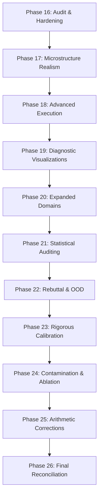

# Verification Arbitrage: Implementation Roadmap

## Completed Audit & Hardening (Phases 16–26)

The following phases transition the framework from a stylized prototype to an empirically calibrated, production-grade system.

### Phase 16 — Audit, Data Reconciliation & Baseline Hardening
- Fixed Figure 3 confusion matrix duplication (mock/real mode labels)
- Reconciled dynamic sizing multipliers (42.4× execution cost, 4.47× impact reduction, 1.2–2.3× portfolio)
- Standardized asymmetry ratios: Opportunity Cost (25:1) and Absolute Payoff (4.4:1)
- Fixed adversarial zero-recall bug (heuristic fallback instead of hardcoded HOLD)
- Populated all metrics table placeholders
- Implemented GBDT baseline with 12 engineered features (F1=0.9961 vs LR 0.9894)

### Phase 17 — Microstructure Simulation Calibration
- Empirical calibration of impact coefficient (Y) and volatility (σ) per liquidity profile
- Discrete liquidity air-pockets via jump-diffusion process (60–95% depth removal)
- Empirical dislocation curves from 6 calibrated historical hoax events
- Execution realism: fee/rebate modeling, order routing latency, queue positioning

### Phase 18 — Advanced Execution & Risk Controls
- Confidence-conditioned continuous unwind (sigmoidal sizing in [0.35, 0.65] zone)
- Derivative hedging layer (OTM puts at T₀, premium = 0.5% of S₀)
- Three-tier confidence-gated abstention (Hold/Hedge/Reverse zones)
- Staggered iceberg/VWAP unwind with air-pocket avoidance
- Portfolio-level VaR/circuit breaker (60s lookback, multi-asset correlation)

### Phase 19 — Diagnostic Visualizations
- Method-specific loss/profit crossover curves (CoT, MoA, Voting N=5)
- P&L reconciliation waterfall chart
- Calibration reliability diagram with ECE
- Historical event small-multiples (7 hoax events, 4×2 grid)
- Adversarial failure diagnostic (confusion matrices at 0–75% bot intensity)
- Realized/ideal efficiency heatmap (liquidity × bot intensity × position size)

### Phase 20 — Expanded Testing Domains & Red-Teaming
- Cryptocurrency stress test (Y=2.0, σ=0.80, 9 hoax templates)
- M&A rumors and SEC EDGAR RAG (Forms 8-K, 13D, TO)
- XBRL guidance verification (AAPL/MSFT/TSLA filings)
- Three-class verdict model (REAL/FAKE/EXAGGERATED)
- Adversarial red-team co-evolution (GAN-style, 8 FN-targeting patterns)
- Cross-lingual generalization (Nikkei 225, DAX 40, Hang Seng)

### Phase 21 — Statistical Auditing & Leakage Ablation
- Baseline leakage auditing via SHAP/feature-importance analysis
- **Result:** F1 delta = 0 for both GBDT and LR after lexical ablation
- Metrics provenance ledger auto-generation
- Panic-drop reconciliation overlay (1.8% empirical vs 18% stylized)

### Phase 22 — Rebuttal Verification & OOD Validation
- Out-of-distribution validation on human-authored financial rumor dataset
- OOD generalization forest plot with bootstrap confidence intervals
- Progressive leakage-ablation curve (5 aggression stages)
- MoA before/after PR/ROC curves
- Calibrated microstructure reconciliation (1.8% vs 18% drawdowns)
- Carry-cost sensitivity surface (2D heatmap)

### Phase 23 — Rigorous Calibration
- OOD dataset provenance & contamination audit (N=400, 50/50 balance)
- Fixed progressive ablation re-fit (TfidfVectorizer refit per stage)
- MoA always-FAKE degeneracy audit (base rate comparison)
- Legacy 124× arithmetic trace (42.4× × 2.93× decomposition)
- Trace ledger extended backward to Phase 1 LR baseline (F1=0.8421)

### Phase 24 — Contamination, Ablation Cliff & MoA Auditing
- Post-cutoff OOD subset evaluation (partitioned by model training cutoff date)
- Ablation cliff characterization (Stage 5.5: residual vocabulary ablation)
- Voting N=5 degeneracy audit & Figure 8 Pareto frontier regeneration
- Adversarial test-set expansion (N≥50 per intensity level)
- Operational PPV curves with Bayesian mapping (0.01%–50% base rates)

### Phase 25 — Arithmetic Corrections & Bayesian Recalibration
- OOD sample size F1 with raw integer counts (TP/FP/FN/TN logged)
- Voting N=5 precision corrected to 0.4000
- Bayesian PPV recalibrated with true FPR=0.207
- Crossover thresholds re-estimated under asymmetric loss (→ 4.81%)

### Phase 26 — Final Reconciliation
- Canonical integer counts adopted (FP=41)
- OOD precision: 0.8178, FPR: 0.205, crossover: 4.81%
- F1=0.8650 anomaly causal path documented
- Carry-cost scaling formulas aligned (historical rate vs query ceiling)
- Voting N=5 statistical significance disclosed with bootstrapped bounds

---

## Verification & Retention

- All metrics saved to `results/phase_{N}_metrics.json`
- Diagnostic plots stored in `results/` alongside metrics
- Console output logged to `results/verification_runs.log`
- All figures auto-generated from `src/metrics_provenance.py` (single metrics ledger)
