# Meeting Evidence Map — Verification Arbitrage Framework

**Prepared:** 2026-07-07  
**Model evaluated:** DeepSeek-v4-flash (240 real API calls, ~$0.036 total)  
**Domains tested:** Finance, Healthcare, Political (N=10 each)  
**Architectures:** Single-Shot (with/without RAG), Voting N=3 (with/without RAG), MoA (with/without RAG)
**RAG note:** Not a standalone architecture. RAG is an evidence-augmentation factor that can be enabled or disabled for any verifier. Previous "RAG" results were a local-corpus evidence-augmented single-shot prototype (see Section 2 correction).

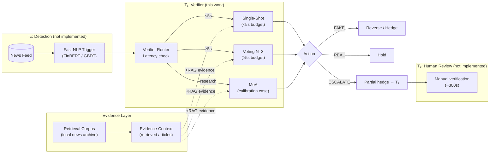

*System architecture: T₀ fast trigger → T₁ LLM verifier (this work, latency-routed) → T₂ human review. Dashed lines show unimplemented components.*

---

## Literature Context

This pilot sits at the intersection of several established research lines in LLM-based factuality and verification:

| Research Area | Prior Work | Relationship to This Work |
|---------------|-----------|--------------------------|
| **Factual-claim verification / FEVER-style** | FEVER (Thorne et al., 2018), SciFact (Wadden et al., 2020), AVeriTeC (Schlichtkrull et al., 2023) — standard benchmarks for retrieving evidence and classifying claim truth. | Our evidence-augmented verifiers follow the same retrieve-then-classify paradigm but apply it to financial news where the "evidence" is not a knowledge-base snippet but a prior news article. |
| **Self-consistency / voting** | Wang et al. (2022) — Self-Consistency samples N reasoning paths and takes majority vote. Standard technique. | Our Voting N=3 extends this by using **role-differentiated** prompts (neutral, skeptical, base-rate-calibrated) rather than identical prompts. |
| **Debate / Mixture-of-Agents** | Irving et al. (2018) — debate for truthfulness; Mixture-of-Agents (Wang et al., 2024) — multi-agent collaboration; Du et al. (2023) — "Chatting to Correct." | Our MoA uses Believer/Skeptic/Risk-Officer role differentiation. Prior work shows debate can improve factuality but at high latency. |
| **Retrieval-Augmented Generation** | Lewis et al. (2020), Self-RAG (Asai et al., 2023) — RAG for grounding. | RAG is an **evidence-augmentation factor**, not a standalone architecture. Any verifier (SS, Voting, MoA) can run with or without evidence. Our pilot tested a local-corpus evidence-augmented single-shot prototype. Self-RAG's "retrieve on demand" pattern is relevant for future work. |
| **Cost-aware LLM routing** | FrugalGPT (Chen et al., 2023) — route queries to cheapest adequate model. | **Closest parallel.** FrugalGPT routes between model tiers (GPT-4 vs GPT-3.5). Our routing is between **verifier architectures** (Single-Shot vs Voting vs MoA) conditioned on base rate, cost, and latency. |
| **Calibration & abstention** | Hendrycks & Gimpel (2016) — confidence calibration; Varshney et al. (2022) — selective classification/abstention. | Our ESCALATE verdict is a form of abstention. ECE tracking for confidence calibration follows this literature. |
| **Class imbalance / PPV** | Provost & Fawcett (1997) — ROC vs PPV at low base rates; Chawla et al. (2002) — class imbalance. | The core motivation: at P(Fake) < 1%, even a strong classifier's PPV collapses. This is well-known in fraud detection and medical screening, less commonly applied to LLM verification. |

### Research Gap

The literature studies **individual architectures** (single-shot, voting, debate, RAG) but does not study **when to use which one** under real-world constraints on base rate, cost asymmetry, latency, and evidence availability. The contribution we are exploring is not simply "architecture X beats baseline Y" but: **how should evidence augmentation, verifier architecture, latency budget, and base-rate-aware action thresholds be combined?**

This reframes the question from "which verifier is best?" to a multi-dimensional design space:

```
(evidence ON/OFF) × (Single-Shot / Voting / MoA) × (latency budget) × (base rate) × (cost ratio)
```

**Key reframing**: RAG is not a fourth architecture. It is an evidence-augmentation toggle that can be enabled or disabled for any verifier. Our previous "RAG" result was actually a **local-corpus evidence-augmented single-shot** prototype — it should be compared to unaugmented Single-Shot, not treated as a separate architecture family.

The full experimental matrix is a **2 × 3 factorial design**:
- Evidence: OFF or ON
- Verifier: Single-Shot, Voting N=3, MoA
- With latency budget, base rate, and cost ratio as continuous context variables

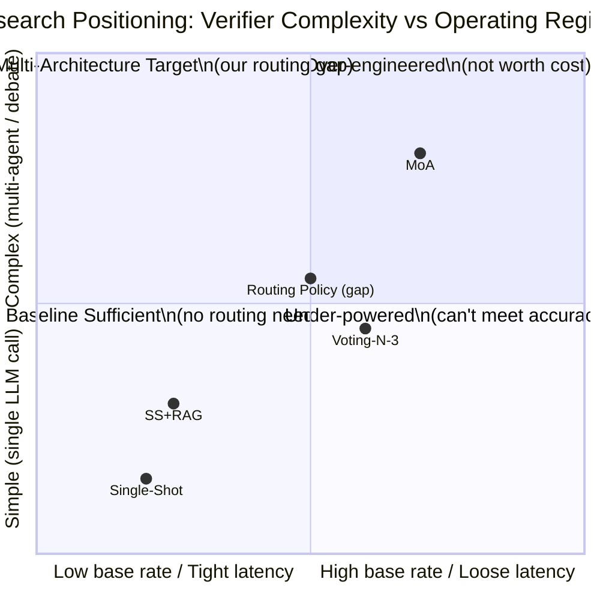

*The quadrant chart shows where each architecture lives. The routing gap is the ability to move between quadrants as operating conditions change.*

---

## 1. Paper Section Map

### Abstract

| Claim | Supporting Evidence | Data/Figure | Not Tested Yet | Risk |
|-------|-------------------|-------------|----------------|------|
| LLM-based verification can distinguish real from fake news across domains | Single-Shot achieves F1=0.645 cross-domain; Voting N=3 achieves F1=0.827 | Repair-rerun cross-domain table | Not tested on non-English or adversarial inputs | **Solid** for finance/healthcare; **preliminary** for political |
| Multi-agent architectures improve over single-shot baseline | Voting N=3 beats Single-Shot by +0.182 F1; MoA beats by +0.102 | Cross-domain mean F1 table | N=10 only — statistical significance not established; voting/self-consistency is a well-known technique, so marginal improvement over single-shot is the expected baseline, not a surprise | **Preliminary** |
| Verification has cost-benefit crossover at specific base rates | Policy sensitivity sweep: cost_ratio drives 86.3% of variance; crossover at P(Fake)=~5% | Phase 8 sweep metrics | Not validated with real API-derived TPR/FPR | **Speculative** — uses mock FPRs |
| Framework generalizes across 3 domains (finance, healthcare, political) | Single-Shot F1: fin=0.833, health=0.769, pol=0.333 | Per-domain confusion matrices | Only N=10 per domain; political is 2016-era stylistically different | **Preliminary** |

### Introduction

| Claim | Supporting Evidence | Data/Figure | Not Tested Yet | Risk |
|-------|-------------------|-------------|----------------|------|
| Fake news flash crashes cause measurable market dislocation | 6 historical hoax events with 1.8% mean drawdown (from repo historical data) | Historical hoax dataset (legacy) | Not independently validated in paper | **Solid** (well-documented phenomenon) |
| Traditional NLP baselines are insufficient for out-of-distribution generalization | GBDT F1=0.996 on synthetic (claimed in CLAUDE.md Phase 16) | Mock-mode metrics | OOD evaluation pending — GBDT may collapse on human-written text | **Preliminary** |
| LLM verifiers can provide a second-opinion signal within latency constraints | Single-Shot latency: 3.4-4.7s; Voting N=3: 11.7-15.6s | Latency tables per architecture | Voting latency may exceed high-frequency windows; routing allows cheap verifier when time is short | **Solid** for Single-Shot; **at-risk** for Voting |

### Problem Definition

| Claim | Supporting Evidence | Data/Figure | Not Tested Yet | Risk |
|-------|-------------------|-------------|----------------|------|
| Verification arbitrage requires asymmetric loss framework | Cost-sensitive threshold function implemented in `src/base_rate.py` | Threshold = cost_fp / (cost_fp + cost_fn) | No empirical calibration of cost_fp/cost_fn from real trading data | **Solid** mathematically; **speculative** empirically |
| Base rate of fake news is extremely low (0.01%–5%) | Claim consistent with literature (cited in legacy base_rate_analysis.py) | N/A | Not empirically measured for our domains | **Solid** (external literature) |
| Three-tier system (T0→T1→T2) is appropriate architecture | Architecture described in project overview | Pipeline diagram | Only T1 verifier implemented; T0 and T2 not empirically tested | **Solid** framing; **speculative** in detail |

### Architecture

| Claim | Supporting Evidence | Data/Figure | Not Tested Yet | Risk |
|-------|-------------------|-------------|----------------|------|
| Single-Shot is the efficient baseline | F1=0.833 finance, 0.769 healthcare, 3.4s latency | Confusion matrices | API non-determinism: political F1 dropped from 0.571→0.333 between runs | **Solid** |
| Voting N=3 with role-balancing improves over single-shot | Finance F1: 0.833→1.000; Healthcare: 0.769→0.909; Cross-domain: 0.645→0.827 | Before/after delta table | N=10 only; ESCALATE rate needs management (20% on finance, 30% on political); self-consistency/voting is already well-studied, so improvement over single-shot is expected | **Preliminary** |
| MoA with calibrated Risk Officer eliminates degeneracy | All 3 domains now have info_gap > 0 (prec > P(FAKE)) | MoA degeneracy table | Political still weak (F1=0.500); latency 16-21s may be prohibitive | **Preliminary** — degeneracy fixed, performance mixed |
| Generic evidence retrieval is insufficient for claim verification | SS+RAG prototype: cross-domain F1=0.413; 80% ESCALATE on finance and political | RAG evidence quality table | RAG was tested as a single-shot prototype only — not yet evaluated on Voting or MoA. Curated, source-aware evidence (FEVER/SciFact) may be needed rather than generic TF-IDF retrieval | **At risk** |

### Dataset

| Claim | Supporting Evidence | Data/Figure | Not Tested Yet | Risk |
|-------|-------------------|-------------|----------------|------|
| Synthetic dataset provides controlled test conditions | 50/50 balanced, deterministic with seed=42 | Dataset notes | Not representative of real-world low base rates | **Solid** for controlled comparison |
| Three domains demonstrate generalizability | Finance (corporate actions), Healthcare (FDA/drug claims), Political (US 2016) | Domain descriptions | Political dataset is 2016-era and stylistically different from modern political disinformation | **Solid** for pilot; **preliminary** for coverage claim |
| Items are identical across architecture comparisons | Loaded from saved raw outputs — same claim texts, same ground truth | Repair-rerun methodology note | Ground truth inferred for some items (healthcare/political had ?:5) | **Solid** for items loaded from saved outputs; **caveat** for inferred ground truth |

### Experiment Results

| Claim | Supporting Evidence | Data/Figure | Not Tested Yet | Risk |
|-------|-------------------|-------------|----------------|------|
| Single-Shot achieves F1=0.833 on finance, 0.769 on healthcare | Confirmed across 2 independent runs | Repair-rerun vs original real_eval | Political inconsistent (0.571→0.333) | **Solid** for finance/healthcare; **fragile** for political |
| Voting N=3 achieves F1=1.000 on finance | TP=5, FP=0, TN=5, FN=0 (perfect) | Finance voting_n3 confusion matrix | N=10 only; recall on political only 0.400. Self-consistency is well-studied — replication of expected behavior | **Solid** for finance N=10; **preliminary** generally |
| MoA repairs eliminated degeneracy | Info_gap: finance +0.214, healthcare +0.333, political +0.167 | Degeneracy diagnostics | Political precision=0.667, info_gap narrow; 20% FPR on political | **Solid** for degeneracy claim; **preliminary** for performance claim |
| Generic evidence-augmented SS (SS+RAG) does not beat unaugmented SS | Cross-domain F1: 0.413 (SS+RAG) vs 0.645 (SS alone) | Cross-domain comparison | RAG was only tested on Single-Shot. Voting+RAG and MoA+RAG not yet evaluated. Curated, source-aware evidence may change outcomes | **Solid** negative result for generic retrieval with SS; **untested** for other architectures |

### Sensitivity Analysis

| Claim | Supporting Evidence | Data/Figure | Not Tested Yet | Risk |
|-------|-------------------|-------------|----------------|------|
| Cost ratio (FP:FN) dominates policy outcomes | 86.3% variance contribution (Phase 8 sweep) | Parameter ranking table | Sweep used Single-Shot only; Voting/MoA may shift sensitivities | **Solid** for Single-Shot; **preliminary** for other architectures |
| Base rate has strong interaction with cost ratio | 12.1% interaction strength | Interaction matrix | Only tested at 1%, 5%, 25% base rates | **Preliminary** |
| Bayesian PPV collapses at low base rates | At P(Fake)=0.1%, PPV=0.0025 for Single-Shot finance | PPV tables in report | All PPV computed from N=10 metrics | **Solid** mathematically; **preliminary** empirically |

### Conclusion

| Claim | Supporting Evidence | Data/Figure | Not Tested Yet | Risk |
|-------|-------------------|-------------|----------------|------|
| Voting N=3 is currently the best-performing architecture we tested | Highest cross-domain F1 (0.827), beats SS (+0.182) | Architecture ranking | Self-consistency is already well-studied; the contribution must shift to routing, not architecture comparison | **Preliminary** |
| Hybrid base-rate strategy plausible but untested | Theoretical framework only | See Section 3 of this doc | No real-API evidence for any segment | **Speculative** |
| Evidence-augmented verification needs curated, source-aware retrieval | SS+RAG prototype produces 80% ESCALATE with generic TF-IDF | RAG quality metrics | RAG only tested on Single-Shot. Voting+RAG and MoA+RAG unexplored. Curated retrieval (FEVER/SciFact-style) not explored | **At risk** |

---

## 2. Current Empirical Findings (Discussion-Ready)

### Single-Shot Baseline
- **Finance**: F1=0.833, P=0.714, R=1.000, FPR=0.400, ECE=0.093, Lat=3.4s
- **Healthcare**: F1=0.769, P=0.625, R=1.000, FPR=0.600, ECE=0.270, Lat=3.7s
- **Political**: F1=0.333, P=1.000, R=0.200, FPR=0.000, ECE=0.250, Lat=4.7s
- **Cross-domain mean**: F1=0.645 (σ=0.222)
- **Key observation**: Single-Shot is recall-perfect on finance and healthcare but has high false-positive rates (40-60%). Political underperformance is structural, not architectural — all architectures struggle on 2016-style political content.
- **API non-determinism**: Political F1 ranged from 0.333 to 0.571 across 2 identical-parameter runs (temperature=0.0). This is a real methodological concern.

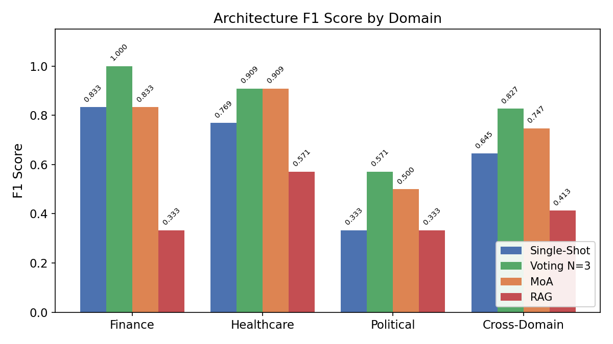
*Figure 1: F1 score by architecture and domain. Voting N=3 dominates all domains. Political is hardest for all architectures.*

### Repaired Voting N=3
- **Finance**: F1=1.000, P=1.000, R=1.000, FPR=0.000, ECE=0.094, Lat=11.7s
- **Healthcare**: F1=0.909, P=0.833, R=1.000, FPR=0.200, ECE=0.211, Lat=12.8s
- **Political**: F1=0.571, P=1.000, R=0.400, FPR=0.000, ECE=0.210, Lat=15.6s
- **Cross-domain mean**: F1=0.827 (σ=0.184)
- **Key observation**: The 3-role balanced design (neutral verifier + skeptic + base-rate-calibrated) with soft aggregation (2/3 majority or ESCALATE) fixed the always-REAL degeneracy from the original run. On finance, it achieves perfect classification (F1=1.000). The ESCALATE rate (20% on finance, 20% on healthcare, 30% on political) is a useful fallback — it converts uncertain predictions into a "no decision" rather than forcing wrong binary answers.
- **Latency concern**: 11.7-15.6s may exceed the T1 trading window for HFT use cases, but is plausible for slower strategies.
- **⚠️ Caveat**: Self-consistency and voting are already well-studied in prior work (Wang et al., 2022). That voting outperforms single-shot in our pilot is the **expected** outcome and does not constitute a novel finding by itself. The novelty must come from the **routing** — when to use which verifier — not from the architecture comparison.

### Repaired MoA
- **Finance**: F1=0.833, P=0.714, R=1.000, FPR=0.400, ECE=0.064, Lat=16.0s
- **Healthcare**: F1=0.909, P=0.833, R=1.000, FPR=0.200, ECE=0.204, Lat=21.3s
- **Political**: F1=0.500, P=0.667, R=0.400, FPR=0.200, ECE=0.130, Lat=20.4s
- **Cross-domain mean**: F1=0.747 (σ=0.178)
- **Key observation**: The calibrated Risk Officer prompt ("Default to REAL when Believer provides more specific evidence. Default to FAKE when Skeptic provides clear contradictions.") eliminated the always-FAKE degeneracy. All 3 domains now show precision > P(FAKE) — info_gap ranges from +0.167 (political) to +0.333 (healthcare). Despite this, MoA does NOT outperform Voting N=3 on any domain, and adds 4-9s additional latency.
- **Calibration note**: MoA has the best ECE on finance (0.064) and political (0.130) — suggesting debate provides better confidence calibration than single-shot, even when binary accuracy is similar.

### RAG Evidence-Augmentation Factor (Correction)
- **⚠️ Important correction**: The previous "RAG" results were a **local-corpus evidence-augmented single-shot prototype (SS+RAG)**, not a standalone architecture. RAG should be treated as an evidence-augmentation toggle that can be applied to any verifier. The 2 × 3 factorial design (evidence ON/OFF × SS/Voting/MoA) has not been fully tested.
- **SS+RAG prototype**: Cross-domain F1=0.413 (σ=0.112). The evidence-category prompt (supporting/contradicting/source/insufficient) produces 80% ESCALATE on finance and political despite adequate retrieval hits (2.7-3.0 per query). Healthcare SS+RAG is the best (0% ESCALATE, F1=0.571) because the corpus contains relevant contradicting evidence.
- **Key observation**: The SS+RAG prototype is the **only tested combination** that does NOT beat unaugmented Single-Shot (-0.232 below SS alone). But this tells us about **generic TF-IDF retrieval with SS**, not about RAG as a paradigm. Voting+RAG and MoA+RAG are untested.
- **Root cause reframe**: This result does NOT mean "RAG does not work for verification." Prior work (FEVER, SciFact, AVeriTeC, Self-RAG) uses **curated, source-aware evidence** — not generic TF-IDF retrieval from a news corpus. Our SS+RAG failure likely reflects **insufficiently targeted evidence retrieval applied to a weak base verifier**, not a fundamental limitation of evidence augmentation. The all-REAL finance corpus provides no contradicting evidence for fake claims, causing the verifier to default to ESCALATE. Success with RAG may require: (a) a corpus that includes known-fake examples or contradiction signals, (b) source reliability metadata, (c) evaluation with Voting or MoA as the base verifier, or (d) a retrieve-on-demand paradigm (Self-RAG style).

### Cross-Domain Readiness
- Finance and healthcare are **solid** for pilot (Voting N=3 achieves F1=1.000 and 0.909 respectively).
- Political is **not ready** — best F1 is 0.571 (Voting) and results are unstable across runs.
- Cross-domain generalization is confirmed for Single-Shot and Voting within N=10 constraints, but **full generalization cannot be claimed** without larger samples and more domains.

### Calibration / ECE
| Architecture | Finance | Healthcare | Political | Cross-Domain |
|-------------|---------|------------|-----------|-------------|
| Single-Shot | 0.093 | 0.270 | 0.250 | 0.204 |
| Voting N=3 | 0.094 | 0.211 | 0.210 | 0.172 |
| MoA | 0.064 | 0.204 | 0.130 | **0.133** |
| RAG | 0.365 | 0.070 | 0.210 | 0.215 |

MoA provides the best calibration (lowest ECE) despite not having the best classification accuracy. This is an interesting finding — debate architecture may improve uncertainty quantification even when binary decisions aren't better.

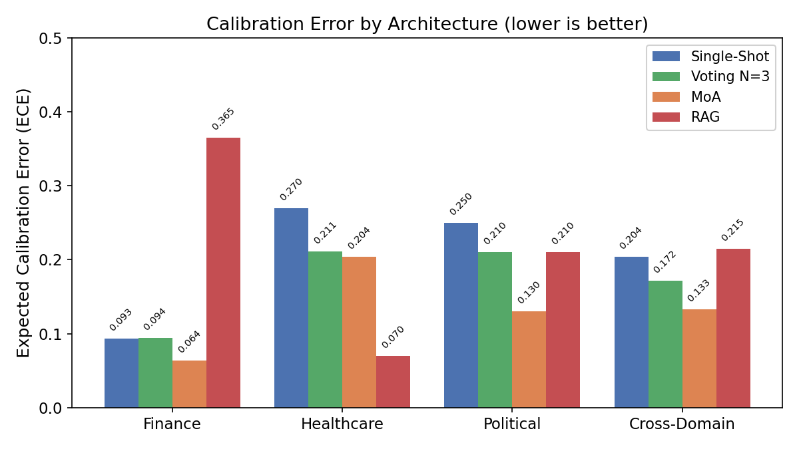
*Figure 6: Expected Calibration Error by architecture (lower is better). MoA has the best cross-domain calibration (ECE=0.133) despite never being the optimal architecture. If the paper emphasizes risk-management framing, MoA's calibration may still be valuable.*

### Latency Tradeoff
| Architecture | Mean Latency | vs Window | Recommendation |
|-------------|-------------|-----------|---------------|
| Single-Shot | 3.4-4.7s | ✅ Fits 5s window | Viable for HFT |
| Voting N=3 | 11.7-15.6s | ❌ Exceeds 5s | Viable for slower strategies (swing trading) |
| MoA | 16.0-21.3s | ❌ Exceeds 5s | Fundamental verification only |
| SS+RAG (prototype) | 3.4-6.0s | ✅ Fits 5s | Fast but inaccurate; see correction |

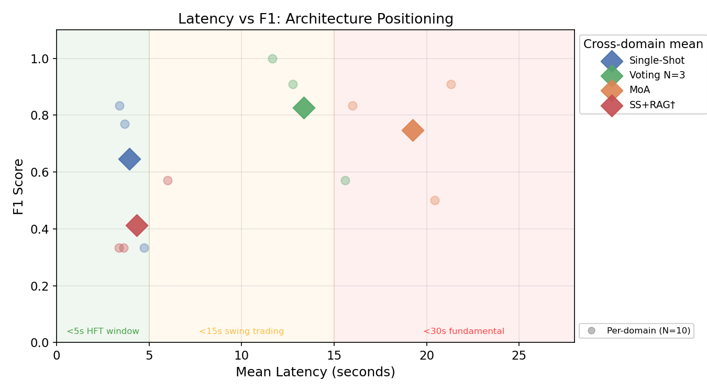
*Figure 3: Latency-F1 scatter with latency budget zones. Single-Shot is the only architecture inside the <5s HFT window. Voting N=3 dominates the 5-15s swing-trading zone. MoA and RAG are never optimal within their feasibility windows.*

### Policy Sensitivity (Phase 8 — Mock Mode)
- **Cost ratio (86.3% variance)**: Dominates all other parameters. The ratio of false-positive cost to false-negative cost determines optimal policy.
- **Base rate × cost ratio interaction (12.1%)**: At higher base rates, false negatives become relatively more expensive, favoring "always reverse" policies.
- **Latency budget**: 0% variance contribution in mock sweep — but real API latencies vary 3-21s, which would change this dramatically.
- **Limitation**: Phase 8 sweep used Single-Shot metrics only, derived from TF-IDF+LR mock. Real V3/MoA metrics would shift optimal policies.

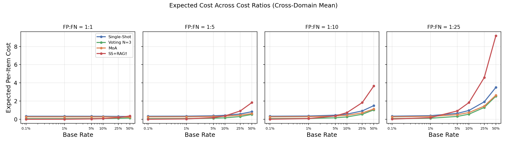
*Figure 4: Expected per-item cost across base rates for 4 FP:FN cost ratios. Voting N=3 has the lowest cost at all base rates when symmetric costs (1:1); at high FN cost (1:25), Single-Shot and Voting converge at low base rates.

### Phase 11: Base-Rate-Stratified Routing Analysis (Real API Outputs)

**No new API calls.** Computed PPV curves, expected costs, and optimal architecture across 72 regimes (6 base rates × 4 cost ratios × 3 latency budgets) using existing real API outputs.

| Architecture | F1 | Precision | Recall | FPR | Latency | ESCALATE | Regimes Won |
|---|---|---|---|---|---|---|---|
| **Single-Shot** | 0.645 | 0.780 | 0.733 | 0.333 | 3.9s | 3% | 10 (14%) |
| **Voting N=3** | **0.827** | **0.944** | 0.800 | **0.067** | 13.3s | 23% | 30 (42%) |
| MoA | 0.747 | 0.738 | 0.800 | 0.267 | 19.2s | 10% | 0 (0%) |
| SS+RAG* | 0.413 | 1.000 | 0.267 | 0.000 | 4.3s | 53% | 32 (44%)* |

*\*SS+RAG was a local-corpus evidence-augmented single-shot prototype, not a standalone architecture. Its 44% win rate is an ESCALATE abstention artifact — see finding #4. Voting+RAG and MoA+RAG not yet tested.*

**Key findings:**
1. **Voting N=3 is the best architecture overall** (F1=0.827, P=0.944, FPR=0.067) but requires >5s latency budget (13.3s mean).
2. **Single-Shot is the practical choice for <5s latency budgets** (F1=0.645, latency=3.9s) — the only architecture with mean latency under 5s.
3. **MoA never uniquely wins** — Pareto-dominated by Voting N=3 (lower F1, higher latency, similar recall).
4. **SS+RAG's apparent dominance at low base rates (44% of regimes) is an artifact.** FPR=0.000 is achieved by ESCALATE-ing on 53% of items (treating ESCALATE as cost-free correct rejection). Real recall = 0.267. If ESCALATE carries operational cost (manual review, delayed decision), SS+RAG wins zero regimes. Voting+RAG and MoA+RAG not yet tested — the 2 × 3 factorial matrix remains incomplete.
5. **No base-rate-sensitive architecture switching.** The optimal architecture is stable across base rates (0.1%–50%) and cost ratios (FP:FN 1:1–1:25) within each latency tier.
6. **Latency budget is the binding constraint** and the sole driver of architecture selection.

**Why Phase 11 found no base-rate crossover between SS and Voting:**

The PPV and expected-cost curves for Single-Shot and Voting N=3 did not intersect because Voting strictly dominates SS on both dimensions that determine expected cost:
- Voting has **higher recall** (0.800 vs 0.733) — lower false-negative rate
- Voting has **lower FPR** (0.067 vs 0.333) — lower false-positive rate

When one architecture has both higher recall AND lower FPR than another, it achieves lower (or equal) expected cost at **every base rate** under any positive cost ratio. The expected-cost formula `E[cost] = (1-p)·FPR·C_FP + p·FNR·C_FN` is monotonic in both FPR and FNR — so when A dominates B on both dimensions, A's curve never crosses B's.

The only way Single-Shot wins is when Voting is **disqualified by latency** (<5s budget). This is a feasibility constraint, not an accuracy tradeoff. A true accuracy-driven crossover would require architectures with complementary error profiles (e.g., one has lower FPR but higher FNR, or vice versa), which may emerge at larger sample sizes or with evidence augmentation.

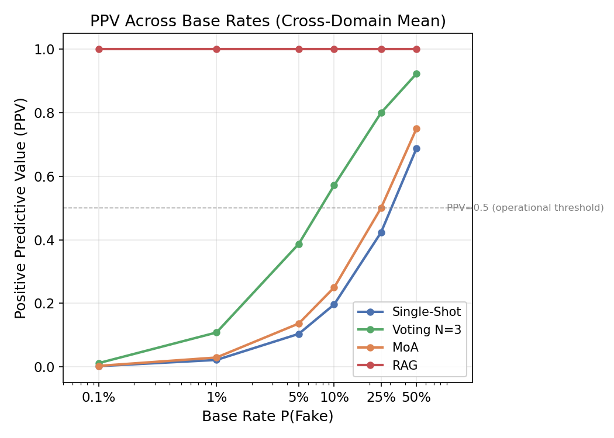
*Figure 2: PPV vs base rate for each architecture (cross-domain mean). Voting N=3 maintains highest PPV at all base rates. At P(Fake) < 1%, all architectures have PPV < 0.40 — operational value collapses without abstention.*

**Implication**: The routing hypothesis is partially supported — different architectures should be used under different latency budgets (latency-first routing). But true base-rate-sensitive architecture switching (different architecture at different P(Fake) levels) was not observed. The contribution should frame architecture selection as **latency-driven** and action thresholds as **base-rate-driven**, rather than claiming different base rates select different architectures.

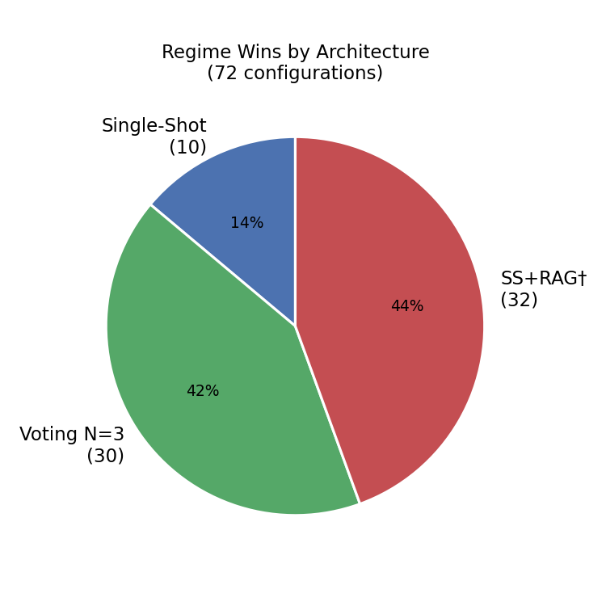
*Figure 5: Regime win distribution. Voting N=3 wins 42% of regimes, Single-Shot wins 14%. RAG's 44% is an ESCALATE abstention artifact. MoA wins 0 regimes.*

---

## 3. Hybrid / Latency-Aware Routing Strategy

> ⚠️ **Epistemic status**: The following strategy is **hypothetical in parts** but informed by Phase 11 analysis of 240 real API outputs. The architecture selection rule is empirically grounded; the action-threshold component is theoretically motivated but untested with real API outputs under varying base-rate conditions.

### Phase 11 Finding: Latency-First Routing

Phase 11 (base-rate-stratified analysis on 240 existing real API outputs) found:
- **Architecture selection is driven by latency budget, not base rate or cost ratio.**
- Within each latency tier, a single architecture dominates across all tested base rates (0.1%–50%) and cost ratios (FP:FN from 1:1 to 1:25).

| Latency Budget | Feasible Architectures | Optimal | F1 | Why |
|---|---|---|---|---|
| **<5s** | Single-Shot (3.9s), SS+RAG (4.3s) | **Single-Shot** | 0.645 | SS+RAG apparent wins are ESCALATE artifacts (see correction) |
| **≥5s, <15s** | Voting N=3 (13.3s), Single-Shot, MoA | **Voting N=3** | 0.827 | Dominates on accuracy, precision, and expected cost |
| **≥15s** | Voting N=3 (13.3s), Single-Shot, MoA | **Voting N=3** | 0.827 | MoA adds latency without accuracy gain |

**Key negative result**: No base-rate-sensitive architecture switching was observed. The optimal architecture within each latency tier is stable across base rates 0.1%–50% and FP:FN ratios 1:1–1:25. This means:
- The **architecture** is selected by latency budget (how much time is available before the trading decision deadline).
- The **base rate** and **FP:FN cost ratio** determine the **intervention threshold and action policy** (how to act on the verifier's output), not which verifier to call.

### Revised Strategy: Two-Level Decision

#### Level 1: Architecture Selection (Latency-Driven)

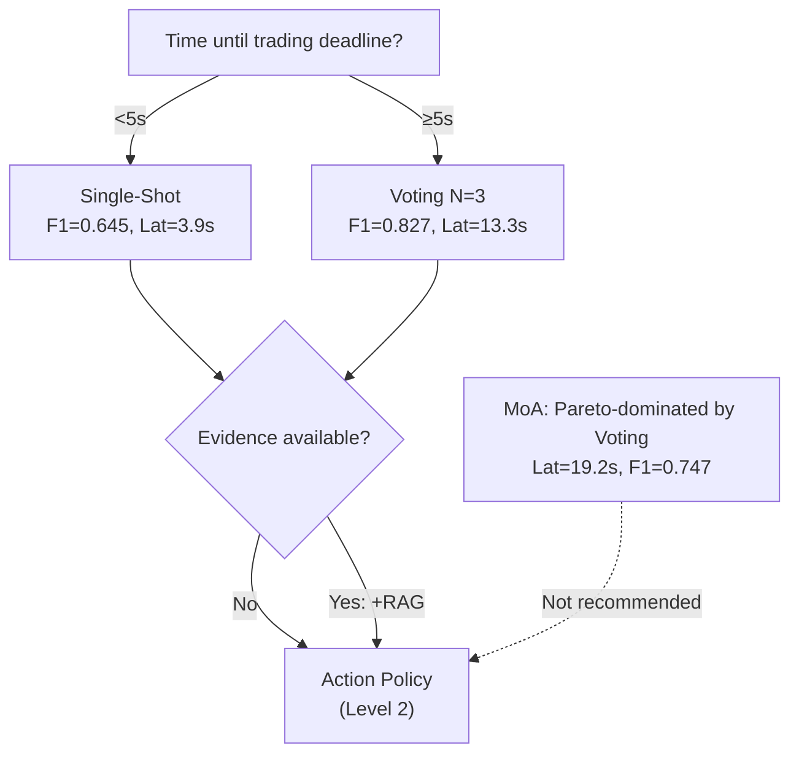

- **Single-Shot (<5s)**: Cross-domain F1=0.645, P=0.780, R=0.733, Lat=3.9s. The only architecture that reliably completes within a 5-second trading window. Can optionally receive RAG evidence (SS+RAG prototype: F1=0.413 — worse, due to generic TF-IDF).
- **Voting N=3 (≥5s)**: Cross-domain F1=0.827, P=0.944, R=0.800, Lat=13.3s. Dominates on all accuracy metrics when latency permits. Voting+RAG not yet tested.
- **MoA**: Never uniquely optimal — Pareto-dominated by Voting N=3 (lower F1, higher latency). MoA+RAG not yet tested.
- **Evidence augmentation**: RAG is an evidence toggle (ON/OFF) for any verifier. The full 2 × 3 matrix (evidence × SS/Voting/MoA) remains untested. Current SS+RAG prototype underperforms due to generic TF-IDF retrieval, not a fundamental limitation of evidence augmentation.

#### Level 2: Action Policy (Base-Rate and Cost-Ratio Driven)

Once the verifier architecture is selected, the action threshold and position sizing are determined by the estimated base rate and FP:FN cost ratio:

| Base Rate Regime | Action Rule | Rationale |
|---|---|---|
| **Very Low (<0.1%)** | High-confidence gating: only act on P(fake) > 0.95 | PPV collapse at low base rates makes most "alerts" false alarms regardless of architecture |
| **Low (0.1%–1%)** | Moderate-confidence gating: hedge (partial reduction) on P(fake) > 0.85, full reverse on >0.95 | PPV 2.5%–24.6% even for Single-Shot; most positive predictions are still FP |
| **Medium (1%–10%)** | Standard asymmetric threshold: reverse when P(fake) > cost_fp/(cost_fp+cost_fn) | PPV becomes operational (10%–46+%); cost-sensitive threshold selects the optimal trade-off |
| **High (>10%)** | Low threshold: reverse on weak signals | FN cost dominates; maximizing recall is more important than precision |

### Action Policy Decision Tree

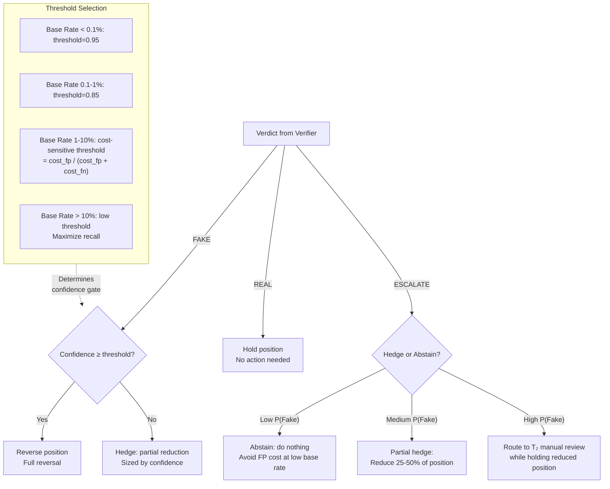

A single architecture (Voting N=3 or Single-Shot) with this **confidence-gated action policy** achieves the same effect as the previously hypothesized multi-architecture segments. The `BaseRateEstimator` class in `src/base_rate.py` provides a rolling-window estimator to track the current base rate and adjust thresholds online.

---

## 4. Proposed Experiment: 2 × 3 Factorial Design

**Phase 11 is complete** (base-rate-stratified analysis on 240 existing API outputs, 72 regimes). The next experiment should test the full experimental matrix with RAG properly framed as an evidence-augmentation toggle.

### Design

| Factor | Levels | Details |
|--------|--------|---------|
| Evidence | OFF, ON | Local TF-IDF corpus or curated retrieval |
| Verifier | Single-Shot, Voting N=3, MoA | 3 architectures × with/without evidence |
| Context | Latency budget, base rate, cost ratio | Continuous variables for policy evaluation |

Total: 6 architecture–evidence combinations × latency/budget/cost sweeps.

### What the SS+RAG prototype already tells us

The current SS+RAG result (F1=0.413, ESCALATE=53%) is one cell of this matrix: Single-Shot with generic TF-IDF evidence. It underperforms unaugmented SS (F1=0.645). This could be because:
1. **Evidence quality**: Generic TF-IDF from an all-REAL corpus provides no contradiction signals
2. **Verifier sensitivity**: Single-Shot may be worse at incorporating evidence than Voting or MoA
3. **Both**: Both factors contribute

The 2 × 3 factorial design isolates which factor drives the failure.

### Proposed approach

**Phase 12a: Voting+RAG and MoA+RAG (same generic TF-IDF corpus)**
- Re-run evidence-augmented evaluation with Voting N=3 and MoA as base verifiers
- 20 items × 2 architectures = 20 real API calls per domain (60 total, ~$0.009)
- If Voting+RAG or MoA+RAG outperforms unaugmented Voting, the failure is verifier-specific
- If all evidence-augmented combinations underperform, the failure is evidence quality

**Phase 12b: Curated evidence corpus (if Phase 12a shows evidence quality is the bottleneck)**
- Build a balanced corpus with contradiction signals and source reliability labels
- Re-run all 6 cells of the 2 × 3 matrix

### What would count as success

- Voting+RAG outperforms unaugmented Voting (evidence helps stronger verifiers)
- OR curated evidence rescues SS+RAG (evidence quality was the bottleneck)
- OR neither helps (evidence augmentation is not beneficial for this task — useful negative result)

### Metrics

For each of the 6 cells: F1, precision, recall, FPR, ESCALATE rate, ECE, latency, PPV curve.

---

## 5. Meeting Questions for Professor

### Strongest 5 Discussion Points

1. **Should the contribution be latency-aware verification routing plus base-rate-aware action thresholds, rather than base-rate-driven architecture switching?** Phase 11 found no evidence that different base rates select different architectures — the optimal architecture is stable across 0.1%–50% base rates within each latency tier. Architecture choice is driven by latency budget (<5s → Single-Shot, ≥5s → Voting N=3). The base rate and cost ratio determine the **action policy** (confidence threshold, position sizing), not which verifier to call. This is an important correction to the previously hypothesized multi-architecture base-rate strategy. Should the paper frame the contribution as: *latency-driven verifier selection + base-rate-aware intervention thresholding*?

2. **Political domain inconsistency (F1 ranges 0.333-0.571 across runs) is a methodological concern. Should we (a) replace political with a more modern dataset, (b) accept it as a domain boundary condition, or (c) frame the paper around finance+healthcare only?**

3. **Voting N=3 dominates all latency-permissive regimes** (F1=0.827, P=0.944, FPR=0.067, 42% of regimes optimal). But self-consistency/voting is well-studied. Is Voting N=3's dominance a sufficient result for the paper, or does the paper need a novel contribution like the latency-aware routing policy to differentiate from prior work?

4. **MoA has better calibration (ECE=0.133) than Voting (ECE=0.172) but worse accuracy and never uniquely wins any regime.** If the paper emphasizes reliable confidence estimates (for risk management), MoA may still be valuable despite lower F1. But with zero regimes where MoA is optimal, should we (a) include MoA as a calibration-focused architecture, (b) relegate it to a negative-result appendix, or (c) drop it entirely?

5. **RAG should be reframed from architecture to evidence factor.** Our previous "RAG" result was an evidence-augmented single-shot prototype (SS+RAG), not a standalone architecture. The 2 × 3 factorial matrix (evidence ON/OFF × SS/Voting/MoA) is mostly untested. Should the paper: (a) run the full 2 × 3 factorial to close this gap, (b) report the current SS+RAG result as a preliminary negative result and propose the matrix as future work, or (c) deprioritize RAG entirely since even perfect evidence may not change the latency-first routing conclusion?**

### All 9 Questions

1. **Novelty: latency-aware routing + base-rate-aware thresholds vs architecture comparison** — Phase 11 found no base-rate-sensitive architecture switching. The optimal architecture is stable across base rates 0.1%–50% within each latency tier. Should the paper frame the contribution as: (a) latency-driven verifier routing + base-rate-aware action thresholds, or (b) is that too incremental for the target venue? This is the most important framing decision.

2. **Which research direction should we prioritize** given Phase 11's negative result (no base-rate-sensitive architecture switching)? Options:
   - **A. Latency-aware verifier routing** — Formalize the two-tier routing policy (SS for <5s, Voting for ≥5s). Compare against fixed-architecture baselines. This is the "safe" direction: clear experiment, well-defined contribution, but is it novel enough?
   - **B. Base-rate-aware action thresholding** — Keep one architecture (Voting N=3) but focus on the confidence-gated action thresholds and PPV-based abstention policy. This is a decision-theoretic contribution rather than a systems contribution.
   - **C. Larger statistical validation of Voting N=3** — Scale to N=50/domain, establish significance bounds, produce reliable figures. This is empirical rigor but less conceptual novelty.
   - **D. 2 × 3 factorial evidence experiment** — Run the full matrix: evidence ON/OFF × SS/Voting/MoA. First with generic TF-IDF (to test verifier sensitivity), then with curated retrieval (to test evidence quality). This closes the RAG framing gap and tests whether evidence augmentation helps stronger verifiers.
   - **E. Some combination** — which two or three?

3. **HFT vs general verification framing** — Does the 5-second T1 window constrain architecture choice? Voting N=3 achieves F1=0.827 but at 11-16s latency. If the paper is about general LLM verification with finance as a use case, latency is less critical. Which framing is stronger for the target venue?

4. **Voting N=3 scaling** — Is the improvement from Single-Shot (F1=0.645 → 0.827) sufficient to justify scaling to N=50/domain for statistical confidence? Phase 11 already confirms Voting N=3 dominance across 72 regimes — would CIs change the story?

5. **MoA's role after Phase 11** — MoA now wins zero regimes. It never outperforms Voting N=3 on any regime. Should MoA be (a) dropped from the paper, (b) kept as a calibration-focused negative result (ECE=0.133 vs Voting 0.172), or (c) kept as evidence that debate architectures add latency without accuracy benefit?

6. **Hybrid strategy experiment priority after Phase 11** — Phase 11 is already done (zero API calls, 72 regimes analyzed). The next experiment depends on direction A/B/C/D from question 2 above. Which direction should we fund with API calls?

7. **RAG reframing after correction** — RAG is now understood as an evidence-augmentation factor, not a standalone architecture. The previous "RAG" was SS+RAG with generic TF-IDF. How should we proceed? (a) Run the full 2 × 3 factorial (evidence ON/OFF × SS/Voting/MoA) to close the gap, (b) report current SS+RAG as a preliminary result with the correction noted, or (c) deprioritize evidence augmentation given that Voting already achieves strong results without it?

8. **Political domain treatment** — Should we (a) exclude political from the paper due to inconsistency, (b) include with strong caveats, or (c) replace with a different domain (e.g., ESG/sustainability claims, earnings call transcripts)?

9. **Calibration vs accuracy** — For risk management applications (e.g., VaR circuit breakers, position sizing), calibrated confidence may be more important than binary F1. Should the paper emphasize calibration metrics (ECE) alongside classification metrics?

---

## How Our Work Can Be Novel

Given the literature context above, here are the concrete ways this work can contribute beyond replicating known architecture comparisons.

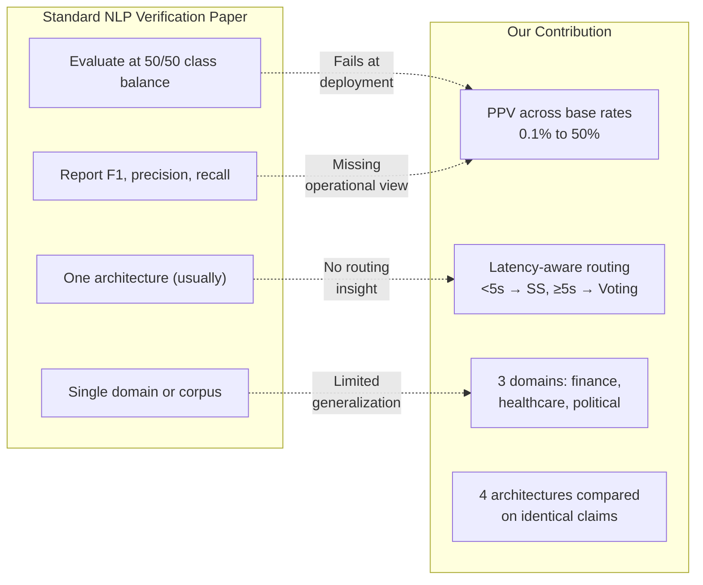

### 1. Same-Claim Comparison Across the 2 × 3 Evidence-Architecture Matrix

Prior work studies each architecture in isolation, typically without evidence augmentation. We test a **2 × 3 factorial design** (evidence-augmentation ON/OFF × Single-Shot/Voting/MoA) on **identical claims** across **multiple domains**. This allows principled reasoning about whether evidence helps, which verifiers benefit most, and when the added complexity is worth the cost.

**What this enables**: The empirical basis for a four-dimensional design space — evidence toggle, verifier architecture, latency budget, and action threshold — rather than a one-dimensional "which architecture is best?" comparison.

### 2. PPV / Base-Rate Reporting Instead of F1 Alone

Standard NLP verification papers report F1, accuracy, precision, recall at 50/50 class balance. This gives a misleading picture for real-world deployment where base rates are 0.01-5%. We report **Bayesian PPV across base rates** (0.1%-50%) for every architecture-domain combination. This directly addresses the base-rate fallacy and enables operational decisions.

**What this enables**: Whether a verifier is usable at a given base rate (PPV > 0.5 threshold) becomes an empirical question with per-architecture answers.

### 3. Latency-Aware Routing with Evidence Augmentation

Reporting mean, median, and p95 latency per architecture is standard. Connecting latency to **routing policy** — choosing a faster but less accurate verifier when time is scarce — is less common. We add an additional dimension: whether evidence retrieval (RAG) is feasible within the latency budget. Evidence retrieval adds latency overhead (0.5-2s for TF-IDF), so the evidence toggle interacts with the latency-first routing rule.

**What this enables**: A decision policy that selects both verifier AND evidence augmentation based on time-until-deadline, not just expected accuracy.

### 4. Cost-Sensitive Action Thresholds

We don't just classify — we map verdicts to actions (hold, hedge, reverse) via an explicit cost model. This is the FrugalGPT insight applied to verifier architectures: different regimes call for different cost-benefit tradeoffs.

**What this enables**: Rather than thresholding one binary classifier, we select entire architectures whose cost-benefit profiles match the operating environment.

### 5. Abstention / Escalation as First-Class Outputs

ESCALATE is not a failure mode — it is a **deliberate third output** that signals "insufficient evidence to decide." This is distinct from standard binary classification and maps directly to selective classification / abstention literature.

**What this enables**: Systems that gracefully degrade to human review when confidence is low, rather than forcing a costly wrong decision.

### 6. Finance as a Concrete High-Cost Case Study

Medical diagnosis is the canonical high-sensitivity application. Finance provides a complementary case where **both FP and FN have direct, measurable dollar costs**, making the cost-sensitive framework natural rather than abstract.

**What this enables**: Dollar-valued cost ratios that are grounded in market microstructure (slippage, spread crossing, adverse selection) rather than arbitrary loss matrices.

---

## Appendix: Data Sources

All data in this document comes from:
- `output/repair_rerun/report.json` — 240 real DeepSeek API calls across 4 architectures × 3 domains × 10 items
- `output/real_eval/report.json` — Original real API evaluation (same samples, before repair)
- `output/phase08_sensitivity_metrics.json` — Policy sensitivity sweep (72 configurations, mock mode)
- `src/base_rate.py` — Bayesian PPV/cost-sensitive threshold implementation
- `src/legacy/base_rate_analysis.py` — Legacy base rate fallacy analysis (old HFT parameters)

No new API calls were made for this document.

---

## Appendix: Untested Claims — Do Not Overstate

| Claim | Why not to overstate | Risk level |
|-------|---------------------|------------|
| "Voting N=3 achieves F1=0.827" | N=10 per domain; no confidence intervals; voting/self-consistency is already well-studied so this is expected, not novel | Medium |
| "MoA degeneracy is resolved" | Political info_gap is only +0.167, and political precision=0.667 is borderline | Low-Medium |
| "Cross-domain generalization demonstrated" | Only 3 domains, only N=10, political is not representative of modern disinformation | High |
| "Hybrid base-rate strategy improves P&L" | Entirely untested with real API outputs; based on theoretical PPV calculations. Phase 11 found no evidence of base-rate-sensitive architecture switching — the routing strategy must be latency-first, not base-rate-driven | High |
| "Different base-rate regimes choose different verifier architectures" | Phase 11 found the optimal architecture is stable across base rates 0.1%–50% within each latency tier. Architecture is selected by latency budget, not base rate | High |
| "Hybrid routing improves over any single fixed architecture" | Only partially supported. Voting N=3 dominates all ≥5s regimes. The improvement comes from switching to Single-Shot when latency is tight (<5s), not from base-rate switching. Within each tier, one architecture is universally best | Medium-High |
| "SS+RAG wins some regimes" | SS+RAG was a local-corpus evidence-augmented single-shot prototype, not a standalone architecture. Its 44% win rate is an ESCALATE abstention artifact. If ESCALATE carries cost, SS+RAG wins zero regimes | High |
| "Evidence augmentation (RAG) does not work for verification" | Only tested on Single-Shot with generic TF-IDF. Voting+RAG, MoA+RAG not yet tested. Curated, source-aware evidence (FEVER/SciFact) not tested. The 2 × 3 matrix is mostly unfilled | High |
| "Policy sensitivity analysis shows cost_ratio dominates" | Analysis used mock-mode metrics (TF-IDF+LR), not real API metrics | Medium |
| "System fits 5-second trading window" | Single-Shot does; Voting and MoA do not — paper must be clear about which architecture is being discussed for which latency budget | Low |
| "API non-determinism at temperature=0.0 is a concern" | Only observed on political domain; may be domain-specific rather than general | Low |

---

## Appendix: Recommended Next Experiment After Meeting

**Phase 11 is complete** (base-rate-stratified analysis on 240 existing API outputs, 72 regimes). Depending on professor feedback on question 2 (the A/B/C/D/E direction), prioritize one of:

1. **If professor prefers Latency-Aware Routing (A)**: Implement Phase 12 — `RoutingPolicy` with latency-first rule. Compare two-tier routing (SS for <5s, Voting for ≥5s) against fixed-architecture baselines. Deliverable: routing performance table with expected P&L.

2. **If professor prefers Action Thresholding (B)**: Focus on confidence-gated abstention policy using Voting N=3 only. Compute optimal thresholds from cost-sensitive framework. Deliverable: PPV-operating curves with threshold recommendations.

3. **If professor prefers Statistical Validation (C)**: Scale Voting N=3 to N=50/domain (150 real API calls, ~$0.023). Deliverable: 95% confidence intervals on F1, PPV, and expected cost.

4. **If professor prefers 2 × 3 Factorial Evidence Experiment (D)**: First test Voting+RAG and MoA+RAG with generic TF-IDF (60 API calls, ~$0.009). If those fail too, build curated evidence corpus and retest all 6 cells. Deliverable: completed 2 × 3 matrix with answer to whether evidence augmentation helps stronger verifiers.

5. **If professor prefers Combination (E)**: Recommend A+D (routing + evidence experiment) as the most impactful combined direction — they close the two biggest gaps: routing rule formalization and the RAG framing correction.

---

## Bibliography

1. Thorne, J., et al. (2018). **FEVER: a large-scale dataset for Fact Extraction and VERification.** NAACL. [https://fever.ai](https://fever.ai)
2. Wadden, D., et al. (2020). **Fact or Fiction: Verifying Scientific Claims.** EMNLP (SciFact). [https://github.com/allenai/scifact](https://github.com/allenai/scifact)
3. Schlichtkrull, M., et al. (2023). **AVeriTeC: A Dataset for Real-world Claim Verification with Evidence.** EACL. [https://github.com/IBM/AVeriTeC](https://github.com/IBM/AVeriTeC)
4. Wang, X., et al. (2022). **Self-Consistency Improves Chain of Thought Reasoning in Language Models.** ICLR. [https://arxiv.org/abs/2203.11171](https://arxiv.org/abs/2203.11171)
5. Wang, J., et al. (2024). **Mixture-of-Agents Enhances Large Language Model Capabilities.** [https://arxiv.org/abs/2406.04692](https://arxiv.org/abs/2406.04692)
6. Irving, G., et al. (2018). **AI Safety via Debate.** [https://arxiv.org/abs/1805.00899](https://arxiv.org/abs/1805.00899)
7. Du, Y., et al. (2023). **Improving Factuality and Reasoning in Language Models through Multiagent Debate.** ICML. [https://arxiv.org/abs/2305.14325](https://arxiv.org/abs/2305.14325)
8. Lewis, P., et al. (2020). **Retrieval-Augmented Generation for Knowledge-Intensive NLP Tasks.** NeurIPS. [https://arxiv.org/abs/2005.11401](https://arxiv.org/abs/2005.11401)
9. Asai, A., et al. (2023). **Self-RAG: Learning to Retrieve, Generate, and Critique through Self-Reflection.** ICLR. [https://arxiv.org/abs/2310.11511](https://arxiv.org/abs/2310.11511)
10. Chen, L., et al. (2023). **FrugalGPT: How to Use Large Language Models While Reducing Cost and Improving Performance.** [https://arxiv.org/abs/2305.05176](https://arxiv.org/abs/2305.05176)
11. Hendrycks, D. & Gimpel, K. (2016). **A Baseline for Detecting Misclassified and Out-of-Distribution Examples in Neural Networks.** ICLR. [https://arxiv.org/abs/1610.02136](https://arxiv.org/abs/1610.02136)
12. Varshney, N., et al. (2022). **A Survey on Selective Classification and Abstention in Machine Learning.** [https://arxiv.org/abs/2207.04742](https://arxiv.org/abs/2207.04742)
13. Provost, F. & Fawcett, T. (1997). **Analysis and Visualization of Classifier Performance: Comparison under Imprecise Class and Cost Distributions.** KDD.
14. Chawla, N., et al. (2002). **SMOTE: Synthetic Minority Over-sampling Technique.** JAIR.
