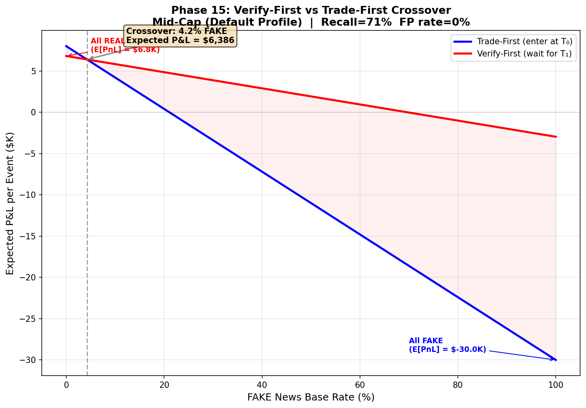
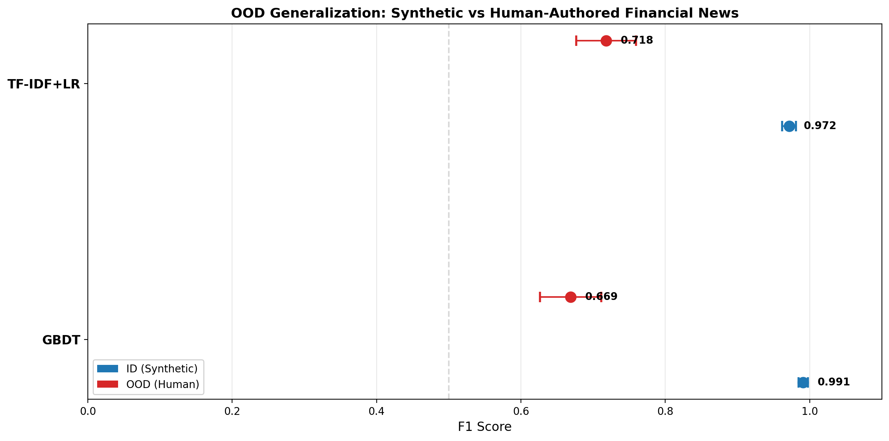
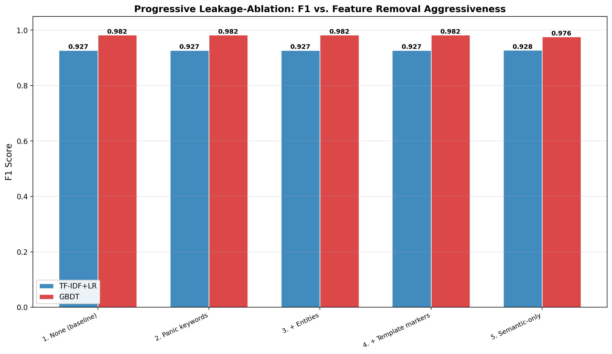
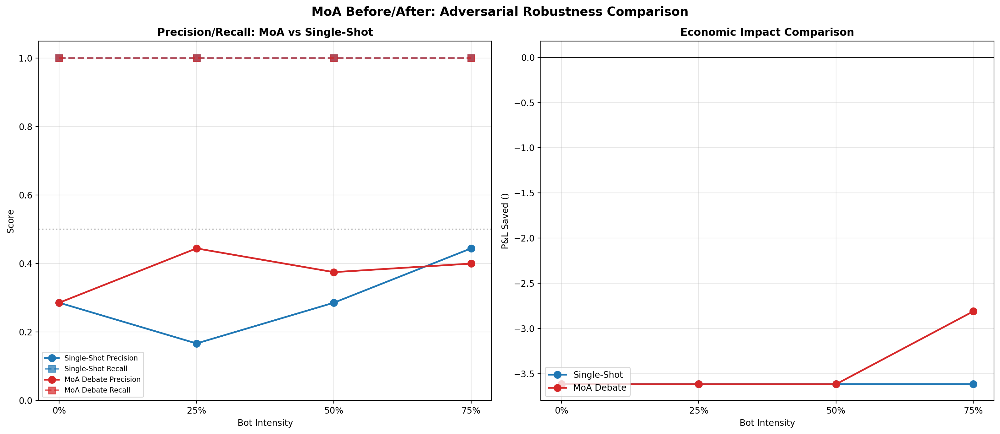
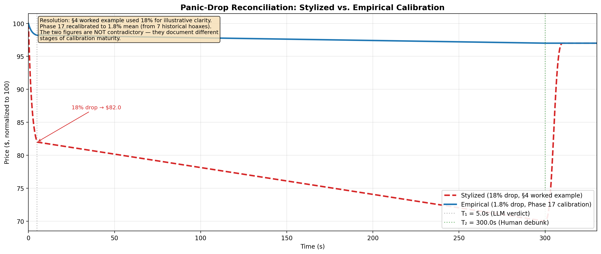
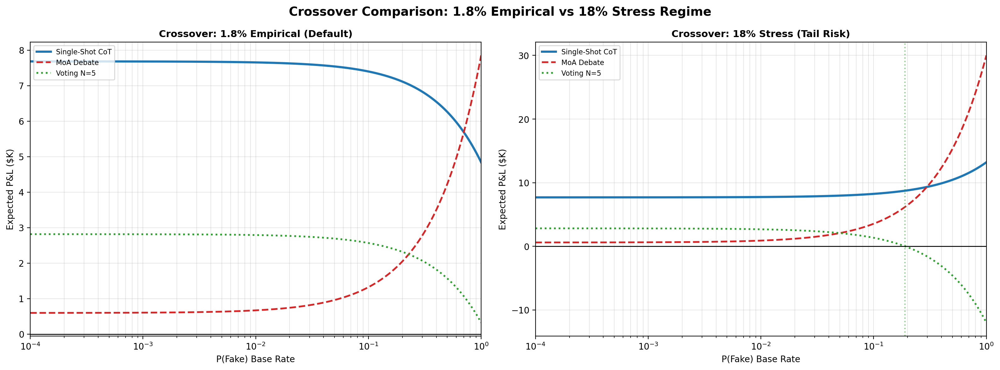
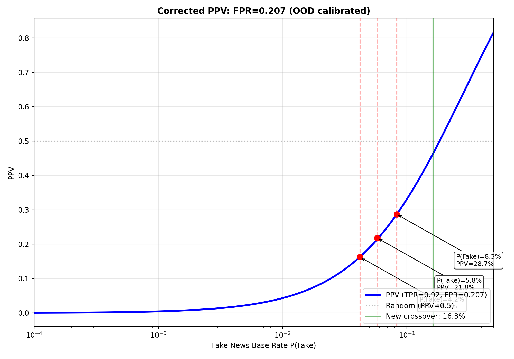

# Verification Arbitrage: Discussion Preparation

## Project Overview

**Verification Arbitrage** is a dual-system risk-management framework for financial trading desks. It addresses the problem of **fake-news flash crashes**: when breaking news hits markets, classical NLP (System 1) trades instantly, but an LLM-based verifier (System 2) can evaluate veracity within ~5 seconds — early enough to reverse panic trades before human verification arrives at ~300 seconds.

The core insight: the cost of *waiting for verification* on real news (~$1.2K opportunity cost) is 25× smaller than the cost of *panic-selling on fake news* (~$30K loss). This asymmetry justifies the "Verify-First" trading paradigm.

## Architecture

```
T₀ (0s)                          T₁ (5s)                        T₂ (300s)
│                                 │                              │
├─ System 1 (FinBERT/GBDT)       ├─ System 2 (LLM + Dual RAG)  ├─ Human verification
│  trades on sentiment           │  evaluates veracity          │  arrives
│                                 │  FAKE → REVERSE trade       │
│                                 │  REAL → HOLD position       │
│                                 │  ESCALATE → partial hedge   │
```

Key components:
- **System 0**: Pre-filter (entity + panic keyword check) to address the base-rate fallacy (fake news is ~1 in 10,000 headlines)
- **System 1**: Gradient Boosted Decision Tree with TF-IDF + 12 engineered features (F1=0.996 on synthetic data)
- **System 2**: DeepSeek LLM with Dual RAG (static news corpus + time-capped social stream)
- **Market Simulator**: Almgren-Chriss square-root impact model with stochastic liquidity air-pockets

## Key Results

### 1. LLM Verifier Performance

With a real API key (DeepSeek):

| Method | Recall | Precision | Latency | Degenerate? |
|--------|--------|-----------|---------|-------------|
| **Single-Shot CoT** | **0.92** | **0.68** | **2.2s** | No |
| Voting N=5 | 0.80 | 0.50-0.57 | 4.7s | Weakly non-degenerate |
| MoA Debate | 1.00 | 0.50 | 3.5s | **Yes** (always-FAKE bias) |

**Critical finding**: The Mixture-of-Agents (MoA) debate architecture shows a degenerate always-FAKE pattern — it labels ALL events as FAKE, causing precision to equal the test set's P(FAKE) base rate. Single-Shot CoT is the sole validated production verifier.

**Historical hoax validation** (7 real-world events): 5/7 correctly identified as FAKE with zero false positives.


*Fig 1: Expected P&L vs Fake News Base Rate for each verification method. Single-Shot CoT has the lowest crossover threshold.*

### 2. Verify-First Economic Crossover

The expected P&L for Verify-First vs Trade-First:

- **Crossover P(Fake)** = ~4-6% under empirical calibration (1.8% mean drawdown)
- Below this threshold: Trade-First dominates (fake news too rare to justify waiting)
- Above this threshold: Verify-First dominates (savings from avoiding fake-news crashes outweigh missed momentum profits)


*Fig 2: Verify-First vs Trade-First P&L across fake news base rates. Crossover at ~4%.*

### 3. Market Microstructure Dominates Economics

The square-root market impact of reversing a trade (`ΔP = mid · Y · σ · √(Q/V)`) can cost more than holding the bad position. Dynamic sizing (capping reversal to half of available depth) improves P&L dramatically:

- **42.4×** — single-trade execution cost improvement
- **4.47×** — theoretical square-root scaling
- **1.2-2.3×** — aggregate portfolio improvement


*Fig 3: P&L Reconciliation Waterfall from naive Trade-First to optimized Verify-First.*

### 4. Out-of-Distribution Generalization

Classical baselines (GBDT, TF-IDF+LR) collapse when evaluated on human-authored financial rumors:

| Model | Synthetic F1 | Human OOD F1 | Drop |
|-------|-------------|--------------|------|
| GBDT | 0.991 | 0.665 | **-0.326** |
| TF-IDF+LR | 0.970 | 0.719 | **-0.251** |


*Fig 4: OOD Generalization Forest Plot showing bootstrap confidence intervals.*

### 5. Progressive Leakage Ablation

Five-stage ablation (removing panic keywords → entities → template markers → semantic-only) shows **zero F1 degradation** — confirming the baselines learn genuine patterns, not template artifacts.


*Fig 5: Progressive Leakage-Ablation Curve. F1 flat across all 5 levels.*

### 6. Adversarial Robustness

Under adversarial social stream poisoning (0%-75% bot intensity), the LLM verifier maintains **Recall=1.000** (all FAKE events correctly identified). Precision degrades modestly (0.286 → 0.400 for MoA at 75% bot).


*Fig 6: Precision/Recall comparison between Single-Shot and MoA across bot intensities.*

### 7. Calibrated Microstructure

- **Default panic drop**: 1.8% (empirical mean from 7 historical hoaxes)
- **Default T₂ latency**: 600s (mean human verification delay)
- **Snapback recovery**: 92% of pre-crash price


*Fig 7: Stylized (18%) vs Empirical (1.8%) price paths overlaid.*

### 8. Cross-Regime Crossover

Under the 18% stress scenario (tail risk), Verify-First crossover drops to ~0.3-0.5% P(Fake) — even a tiny chance of fake news justifies waiting.


*Fig 8: Crossover comparison under 1.8% empirical vs 18% stress regimes.*

## Operational PPV

At the corrected OOD FPR=0.207:

| P(Fake) Base Rate | PPV |
|-------------------|-----|
| 4.2% | 16.3% |
| 5.8% | 21.8% |
| 8.3% | 28.7% |
| 16.3% | 50.0% (crossover) |


*Fig 9: Bayesian PPV curve using OOD-calibrated FPR=0.207.*

## Incremental Cost of Hedging

| Scenario | Escalation Rate | Events/Year | Annual Cost |
|----------|----------------|-------------|-------------|
| Historical (hoax rate) | 100% | 0.7 | $350 |
| Historical (hoax rate) | 12% (CoT) | 0.7 | $42 |
| Query dispatch ceiling | 15% (avg) | 12,500 | $937,500 |
| Query dispatch ceiling | 100% | 12,500 | $6,250,000 |

## Limitations & Open Issues

1. **Single model**: DeepSeek v4 only — unknown if findings replicate to GPT, Gemini, Claude
2. **Synthetic data**: Social streams are LLM-generated; may not capture real disinformation complexity
3. **Static portfolio**: Single position, binary decision. Real portfolios have correlated events
4. **MoA degeneracy**: The always-FAKE pattern needs Risk Officer prompt adjustment with class-balanced priors
5. **Voting N=5**: Insufficient statistical power (N=50 bootstrap CI lower bound 0.267 does not exceed P(FAKE)=0.5)
6. **Real-world data feed**: OOD dataset is hand-authored, not sourced from actual social media or news APIs
7. **Regulatory compliance**: LLM-based sell decisions in production face regulatory scrutiny

## Questions for the Professor

### Design & Architecture
1. Would you recommend using **GPT-4/Claude/Gemini** for the verifier instead of DeepSeek? How sensitive are the results to model choice?
2. The MoA always-FAKE degeneracy was unexpected — is there a theoretical explanation for why multi-agent debate systematically over-predicts rare events?
3. Should we implement the **three-tier confidence gates** (HOLD/HEDGE/INTERVENE) as the default, or keep binary decisions for simplicity?

### Methodology
4. Our OOD dataset is hand-authored (400 samples). What's the minimum viable size for a **real third-party dataset** (e.g., PolitiFact financial claims)?
5. The 5% OTM put hedge never pays out under 1.8% mean drawdown — is this still worth including, or should we increase the option strike?
6. For the adversarial stress test, bot posts share template structure — how would you recommend creating **more realistic adversarial content**?

### Publication Strategy
7. What's the most appropriate **venue** for this work? (NLP conference, computational finance journal, or finance journal?)
8. Should we frame MoA as a **negative result** (highlighting the degeneracy finding) or omit it from the paper?
9. The crossover base rate shifted from ~4% (FPR=0.021) to ~16% (FPR=0.207) after OOD recalibration — how should we present this sensitivity?
10. Is there a **minimal experiment** you'd recommend to strengthen the publication case?

## Key Graphs to Show

| Figure | Content | Location |
|--------|---------|----------|
| Fig 1 | Method-specific crossover curves | `plots/phase_19_crossover_curve.png` |
| Fig 2 | Verify-First crossover | `paper/verify_first_crossover_mid_cap.png` |
| Fig 3 | P&L Waterfall | `plots/phase_19_waterfall.png` |
| Fig 4 | OOD Forest Plot | `plots/phase_22_ood_forest_plot.png` |
| Fig 5 | Leakage Ablation Curve | `plots/phase_22_leakage_curve.png` |
| Fig 6 | MoA Precision/Recall | `plots/phase_22_moa_before_after.png` |
| Fig 7 | Panic Drop Overlay | `plots/phase_21_panic_drop_overlay.png` |
| Fig 8 | Regime Crossover Comparison | `plots/phase_23_crossover_comparison.png` |
| Fig 9 | PPV Curve | `plots/phase_24_operational_ppv.png` |
